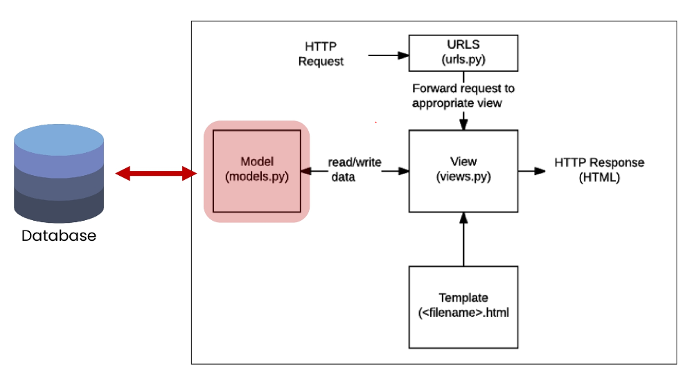
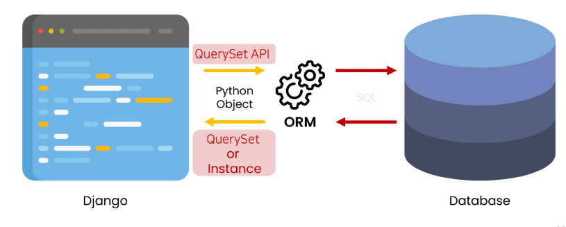

# 02_Django  

---  
### INDEX  

1. Namespace  
2. Django Model  
3. Queryset API  
4. CRUD with view functions  
5. Admin site  

---  
app이 많아지는데, 페이지의 이름이 같은 경우?  

- app_name  
: 각 app/urls.py에 app_name = 'app_names'양식을 추가하고, templates 의 url 태그에 app:template 로 바꾼다.  
  
```python
# articles/urls.py
app_name = 'articles'
```  
```html

```  
---  
#### Template namespace
: templates의 기본 경로에 app_name 폴더 생성해,  `app_name/templates/app_name/`형태로 변경  
```python
# views.py
render(request, 'articles/index.html')
```
---  
### Django Model  

- Database  
: 체계화된 데이터의 모임  
  1. 스키마(Schema)  
    : 뼈대(Structure)  
     자료의 구조, 표현 방법, 관계 등을 정의한 구조  
       
  2. 테이블(Table)  
    : 필드와 레코드를 사용해 조직된 데이터 요소들의 집합  
     관계(Relation)라고도 부른다.  
     
     1. 필드(field)  
    : 속성, 컬럼  
           
     2. 레코드(record)  
    : 튜플, 행(Row)  
        
  - PK(Primary Key)  
    > 각 레코드의 고유한 값(식별자로 사용)  
    > 다른 항목과 중복 X인 단일 값을 가지다.  
    
  - 쿼리(Query)  
    : 데이터를 조회하기 위한 명령어  
    추출, 조작하는 명령어  
    

- Django는 Model을 통해 데이터에 접속하고 관리  
  
  

- 새 프로젝트(crud), 앱(articles) 작성 및 앱 등록  
`django-admin startproject crud .`   
`python manage.py startapp articles`  


- models.py 작성  
: 모델 클래스를 작성하는 것은 데이터베이스 테이블의 스키마를 정의하는 것  
  
```python
# articles/models.py

class Article(models.Model):
    title = models.CharField(max_length=10)
    content = models.TextField()
```
각 모델은 django.db.models 모듈의 models.Model 상속받아 구성된다.  

- CharField(max_length=None)  
: 길이의 제한이 있는 문자열을 넣을 때 사용  
  

- TextField()  
: 글자의 수가 많을 때 사용  
  
--- 
### Migrations  
: Schema인 models.py를 만들었으면, 이를 database에 적용시켜줘야한다.  
database에 table을 생성하기 위한 설계도 작성  
  
1. makemigrations  
: 새로운 설계도(migration)을 만들 때 사용  
&rightarrow; 작성 혹은 변경시 설계도 생성  
`python manage.py makemigrations`  
   

2. migrate  
: makemigrations로 만든 설계도를 실제 db.sqlite3 DB 파일에 반영하는 과정  
   &rightarrow; 변경사항들과 DB의 Schema를 동기화  
   `python manage.py migrate`  
   
- ORM  
: Object-Relational-Mapping  
  `Django<->SQL`데이터 변환하는 프로그래밍 기술  
  Django는 내장 Django ORM을 사용  
  
#### DateTimeField()  
: datetime.datetime 인스턴스로 표시되는 날짜 및 시간을 값으로 사용하는 필드  
- 인자  
: auto_now_add, auto_now  
  
---  
### QuerySet API  

- 외부 라이브러리 설치 및 설정  
`pip install django-extensions`  
  
```python
# settings.py  

INSTALLED_APPS = [
    'articles',
    'django_extensions',
    ..., 
]
```  

- Django shell  
: 일반 파이썬 shell은 django project 환경에 영향 X &rightarrow; Django shell 사용  
  `python manage.py shell_plus`  
  
- Database API  
: Django가 기본적으로 ORM을 제공함에 따른 것, DB를 편하게 조작할 수 있도록 도운다.  
  Model을 만들면 Django는 crud 하는 DB API를 자동으로 만든다.  
  
`Article.objects.all()`  
: Model class.Manage.Queryset API  

"objects" manage  
: DB를 python class 로 조작할 수 있도록 여러 메서드를 제공하는 manager  

Query  
: 데이터베이스에 특정한 데이터를 보여 달라는 요청  

QuerySet  
: 데이터베이스에게서 전달 받은 객체 목록(데이터 모음)  
ORM을 통해 만들어진 자료형  
  
QuerySet API  
: QuerySet과 상호작용하기 위해 사용하는 도구  
  

---  
#### CREATE  
첫번째 방법  
>article = Article()  
>: instance 생성  
>
>article.title  
>: 인스턴수 변수 생성 후 값 할당  
>
>article.save()  

두번째 방법  
: 인스턴스 생성 시 초기 값을 함께 작성하여 생성  
> article = Article(title='title', content= 'content')  
> article.save() # 저장해야 한다.

세번째 방법  
: create() 메서드 활용  
>Article.objects.create(title='title', content= 'content')

`.save()`  
:객체를 데이터베이스에 저장  
id 값은 Django가 아니라 DB에서 계산  
&rightarrow; save 호출 전까지 객체의 id 값은 None  

---  
#### READ  
: QuerySet API method는 크게 2가지로 분류된다.  
> 1. return new querysets  
> 2. do not return querysets  

- all()  
: 전체 데이터 조회  
  `Article.objects.all()`  
  
- get()  
: 단일 데이터 조회  
  객체 없을시 DoesNotExist 예외  
  둘 이상 객체 찾을 시 MultipleObjectsReturned 예외  
  pk와 같이 고유성을 보장하는 조회에서 사용  
  
-filter()  
: 지정된 조회 매개 변수와 일치하는 객체를 포함하는 새 QuerySet 반환  

---  
#### Update  
```
article = Article.objects.get(pk=1)  
수정하고자 하는 article 인스턴스 객체 반환 값 저장

article.title = 'byebye'  
수정후 저장  

article.save()    
```
---  
#### DELETE  

```
article= Article.objects.get(pk=1)
grticle.delete()
```  

--- 
#### CRUD with viewsfunction  

- render, redirect 차이  
  render는 template을 불러오고,  
  redirect는 URL로 이동한다.  
  
-GET  
> 특정 리소스를 가져오도록 요청한다.  
> 반드시 데이터를 가져올 때만 사용  
> DB에 변화를 주지 않고, READ 역할 담당  

- POST  
> 서버로 데이터를 전송할 때 사용  
> 변경사항을 만들고, HTTP body에 담아 전송  
> URL로 보내지 않고, C/U/D 역할 담당  

- csrf_token 템플릿 태그  
: 서버에 요청이 전달되었을때, POST form을 사용하는 경우,  
  임의의 난수 값을 부여해 요청마다 token 값이 유효한지 검증  
  없으면 403 forbidden 응답  
  
---  
### Admin site  

- admin 계정 생성  
`python manage.py createsuperuser`  
  
```python
# articles/admin.py  
from django.contrib import admin
from .models import Article

admin.site.register(Article)
```  


  


