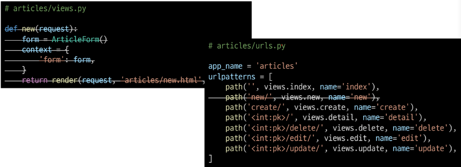
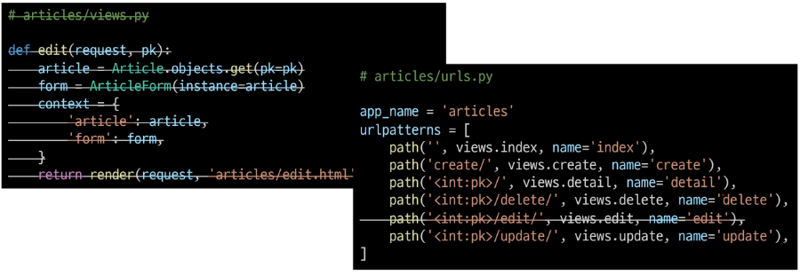

# Dango 04  

### Index  
> - Django Form  
> - Django ModelForm  
> - Hangling HTTP requests  
> - View decorators  

---
### Django Form  
> 사용자로부터 데이터를 받았다. &rightarrow; 모두 수용하고 있지만, 비정상적인, 악의적인 요청이 있을수 있다.  
> &Rightarrow; 우리가 원하는 데이터 형식이 맞는지 `유효성 검증`이 필요하다.  
> Django Form은 is_valid()라는 method 제공  

- Form  
: Django의 유효성 검사 도구 중 하나로 공격 및 데이터 손상에 대한 중요한 방어 수단  
  &rightarrow; Django는 Form과 관련한 유효성 검사를 단순화 하고 자동화 할수 있는 기능 제공  
  - 개발자가 필요한 핵심 부분만 집중할 수 있도록 돕는 프레임워크의 특성  
    
##### Django &rightarrow; Form에 관련된 작업의 세부분을 처리  
1. 렌더링을 위한 데이터 준비 및 재구성  
2. 데이터에 대한 HTML forms 생성  
3. 클라이언트로부터 받은 데이터 수신 및 처리  

---
##### Django Form Class  
- Form Class 선언  
```python
# articles/forms.py

from django import forms 

class ArticleForm(forms.Form):
    title = forms.CharField(max_length=10)
    content = forms.CharField() # model field와 달리 TextField가 존재 X
```

- 'new' view 함수 업데이트  
```python
# articles/views.py

from .forms import ArticleForm

def new(request):
    form = ArticleForm() # form instance 생성
    context = {
        'form':form
    }
    return render(request, 'articles/new.html', context)
```

- 'new' 템플릿  
```html



  <h1>NEW</h1>
  <form action="" method="POST">
    
    {{form.as_p}} 
    <input type="submit"> 
  </form>
  <hr>
  <a href="">[back]</a>

```
&rightarrow; as_p() : 각 field가 `<p>` 태그로 감싸져서 렌더링  

- Django의 2가지 HTML input 요소 표현  
    1) Form fields  
    : 입력에 대한 유효성 검사 로직 처리, 템플릿에서 직접 사용됨  
       `forms.CharField()`
    2) Widgets  
    : 웹 페이지의 HTML input 요소 렌더링을 담당  
       input 요소의 단순한 출력 부분 담당 &rightarrow; form fields에 할당  
       `forms.CharField(widget= forms.Textarea)`
       
---
##### Widgets  
: Django의 HTML input element의 표현 담당  
단순히 HTML 렌더링 처리하는 것  

- Textarea 위젯 적용  
```python
# articles/forms.py

from django import forms 

class ArticleForm(forms.Form):
    title = forms.CharField(max_length=10)
    content = forms.CharField(widget=forms.Textarea)
```

```python
 class ArticleForm(forms.Form):
     NATION_A = 'kr'
     NATION_B = 'ch'
     NATION_C = 'jp'
     NATIONS_CHOICES = [
         (NATION_A, '한국'),
         (NATION_B, '중국'),
         (NATION_C, '일본'),
     ]
    title = forms.CharField(max_length=10)
    content = forms.CharField(widget=forms.Textarea)
    nation = forms.ChoiceField(choices=NATIONS_CHOICES) # choices
```
---
### Django ModelForm  
> Form Class 는 Model Class와 많이 중복된다.  
> Model을 통해 Form Class를 만들 수 있는 helper class  
> ModelForm은 Form과 같은 방식으로 View 함수에서 사용

- ModelForm 선언  
```python
# articles/forms.py

from django import forms
from .models import Article

class ArticleForm(forms.ModelForm):

# 어떤 모델을 기반으로 form을 작성할 것인지 Meta 클래스에 지정
    class Meta:
        model = Article
        fields = '__all__'
```
- Meta Class  
    - ModelForm의 정보를 작성하는 곳  
    - ModelForm 사용시, 참조 할 모델이 있어야 한다  
    &rightarrow; Meta class의 model 속성  
      - 참조하는 모델에 정의된 field 정보를 Form에 적용  
    
    - fields = `'__all__'` : 모델의 모든 fields 포함  
    - exclude = ('title',) : 포함하지 않을 fields 지정
    

- 참조 값과 반환 값
>
>```python
>class Meta:
>    model = Article
>```
>- 함수 &rightarrow; 참조 값
>- 함수() &rightarrow; 반환 값  
> 
> - 참조 값을 사용하는 경우?
>   - 함수 호출 X &rightarrow; "필요한 시점에" 호출하는 경우 사용  
> `ex) path('',views.index, name='index')`  
> 
> 즉 , model을 인스턴스로 만들지 않고, ArticleForm이 필요한 시점에 사용  

---
##### ModelForm with view functions  
- CREATE  
```python
# articles/views.py

def create(request):
    form = ArticleForm(request.POST)
    if form.is_valid(): # 유효성 검사
        article = form.save() # 데이터 저장 후
        return redirect('articles:detail', article.pk) # 상세 페이지로 리다이렉트
    return redirect('articles:new') # 통과 못하면, 작성 페이지로
```

- `is_valid()` method  
: 유효성 검사 실행, 데이터 유효한지 여부 반환  
  
- `save()` method  
```python
# CREATE / 생성
form = ArticleForm(request.POST)
form.save()

# UPDATE / 수정
form = ArticleForm(request.POST, instance=article)
form.save()
```
form 인스턴스에 db 객체 만들고 저장  
instance 여부를 통해 생성, 수정 결정  

- form instance 의 errors 속성  
```python
# articles/views.py

def create(request):
    form = ArticleForm(request.POST)
    if form.is_valid(): # 유효성 검사
        article = form.save() # 데이터 저장 후
        return redirect('articles:detail', article.pk) # 상세 페이지로 리다이렉트
    print(f'에러: {form.errors}')
    return redirect('articles:new') # 통과 못하면, 작성 페이지로
```
: is valid()가 False인 경우, 원인이 dictionary 형태로 저장  
다음과 같이 코드를 작성하면 유효성 검증 실패했을 때, 실패 결과 메시지 출력됨.

```python
# articles/views.py

def create(request):
    form = ArticleForm(request.POST)
    if form.is_valid(): # 유효성 검사
        article = form.save() # 데이터 저장 후
        return redirect('articles:detail', article.pk) # 상세 페이지로 리다이렉트
    context = {
        'form' : form,
    }
    return render(request, 'articles/new.html',context)
```
---
- UPDATE  
: ModelForm의 인자 instance는 수정 대상이 되는 객체를 지정  
  1. request.POST  
    : 사용자가 form을 통해 전송한 데이터 (새로운 데이터)  
  2. instance  
    : 수정이 되는 대상  
     

- edit - view
```python
# articles/views.py

def edit(request, pk):
    article = Article.objects.get(pk=pk)
    form = ArticleForm(instance=article)
    context = {
        'article': article,
        'form': form,
    }
    return render(request, 'articles/edit.html',context)
```
- edit - template  
```html




  <h1>EDIT</h1>
  <form action="" method="POST">
    
    {{form.as_p}} 
    <input type="submit"> 
  </form>
  <hr>
  <a href="">[back]</a>

```

- update - view  
```python
# articles/views.py

def update(request, pk):
    article = Article.objects.get(pk=pk)
    form = ArticleForm(request.POST, instace=article)
    if form.is_valid(): # 유효성 검사
        form.save() # 데이터 저장 후
        return redirect('articles:detail', article.pk) # 상세 페이지로 리다이렉트
    context = {
        'form' : form,
        'article' : article,
    }
    return render(request, 'articles/edit.html',context)
```

##### Form 과 ModelForm  
: ModelForm과 Form은 각자 역할이 다른 것  

- Form  
: 사용자의 입력을 필요로 하며 직접 입력 데이터가 DB 저장에 사용되지 않거나 일부 데이터만 사용될 때  
  ex) login : 데이터를 받아 인증 과정에서만 사용


- ModelForm  
: 사용자의 입력을 필요로 하며 입력 받은 것을 DB fields 에 맞춰 저장할 때  
  데이터의 유효성 검사가 끝나면 각각 맵핑을 어디에 해야할지 알고 있어서 바로 save() 호출 가능  
  
---
### Hangling HTTP requests  
> HTTP requests 처리에 따른 view 함수 구조 변화
> new-vreate, edit-update의 역할에서 공통점, 차이점 존재  

> - 공통점  
>   - new-create : 모두 CREATE 로직을 구현
>   - edit-update : 모두 UPDATE 로직을 구현  

> - 차이점  
>   - new, edit : GET 요청에 대한 처리  
>   - create, update : POST 요청에 대한 처리  

---
##### Create  
- new + create view  
```python
# articles/views.py  

def create(request):
    if request.method == 'POST':
        # create
        form = ArticleForm(request.POST)# 정보는 여기에 들어있다. # 알아서 mapping 된다.
        if form.is_valid(): # 유효성 검사 통과시,
            article = form.save() # 데이터 저장 후
            return redirect('articles:detail', article.pk)
    else:
        # new
        form = ArticleForm()
    context = { # is_valid 에서 튕겨져 나온 else 부분이랑 new랑 가는 부분이 같다.
        'form' : form,
    }
    return render(request, 'articles/new.html', context)
```

- 불필요한 new의 view 함수, url path 삭제  
  
  
- new.html &rightarrow; create.html 이름 변경 및 action 속성 값 수정  

```html
<!--articles/create.html-->




  <h1>CREATE</h1>
  <form action="" method="POST">
    
    {{form.as_p}} 
    <input type="submit"> 
  </form>
  <hr>
  <a href="">[back]</a>

```
- 템플릿 경로 수정  
```python
# articles/views.py  

def create(request):
    if request.method == 'POST':
        # create
        form = ArticleForm(request.POST)# 정보는 여기에 들어있다. # 알아서 mapping 된다.
        if form.is_valid(): # 유효성 검사 통과시,
            article = form.save() # 데이터 저장 후
            return redirect('articles:detail', article.pk)
    else:
        # new
        form = ArticleForm()
    context = { # is_valid 에서 튕겨져 나온 else 부분이랑 new랑 가는 부분이 같다.
        'form' : form,
    }
    return render(request, 'articles/create.html', context)
```
- index 페이지에 있던 new 관련 링크 수정  

```html
<!--articles/index.html-->




  <h1>Articles</h1>
  <a href="">CREATE</a>
  <hr>

```  

def create의 context 들여쓰기 위치 확인할 것.  

---

- Update + edit view  
```python
# articles/views.py

def update(request, pk):
    article = Article.objects.get(pk=pk)
    if request.method == "POST":
        form = ArticleForm(request.POST, instance=article)
        if form.is_valid():
            form.save()
            return redirect('articles:detail', article.pk)
    else:
        form = ArticleForm(request.POST, article.pk)
    context = {
        'article': article,
        'form': form,
    }
    return render(request, 'articles/update.html', context)
```
- edit의 view 함수와 url path 삭제  
  
  
- edit.html &rightarrow; update.html 이름 변경  
```html
<!--articles/update.html-->




  <h1>UPDATE</h1>
  <form action="" method="POST">
    
    {{form.as_p}} 
    <input type="submit"> 
  </form>
  <hr>
  <a href="">[back]</a>

```

```html
<!--articles/detail.html-->

<a href="">UPDATE</a>
```
  
- POST 요청에 대해서만 삭제가 가능하도록 수정  

```python
# articles/views.py

def delete(request, pk):
    article = Article.objects.get(pk=pk)
    if request.method == "POST":
        article.delete()
        return redirect('articles:index')
    return redirect('articles:detial', article.pk)
```

---
### View decorators  
> 데코레이터(Decorator)  
> - 기존 함수에 기능 추가시, 함수를 수정하지 않고 기능 추가해주는 함수  

- Allowed HTTP methods  
> django.views.decorators.http의 데코레이터를 사용하여 요청 메서드를 기반으로 접근 제한  
> 일치하지 않는 메서드 요청 &rightarrow; `405 Method not Allowed`  
> `405 Method not Allowed` : 요청 방법이 서버에게 전달 되었으나 사용 불가능한 상태  
> 
> 
> - Method list  
>   1. require_http_methods()
>   2. require_POST()
>   3. require_safe()  

- require_http_methods()  
: View 함수가 특정한 요청 method만 허용하도록 하는 데코레이터  
  
```python
# views.py  

from django.views.decorators.http import require_http_methods

# GET, POST 에 대한 요청에만 응답.
@require_http_methods(['GET','POST']) 
def create(request):
    pass

# GET, POST 에 대한 요청에만 응답.
@require_http_methods(['GET','POST'])
def update(request, pk):
    pass
```

- require_POST()  
: View 함수가 POST 요청 method만 허용하도록 하는 데코레이터

```python
# views.py

from django.views.decorators.http import require_http_methods, require_POST

@require_POST
def delete(request, pk):
    # if request.method == "POST": # POST 만 허용하므로 필요 없다.
    article = Article.objects.get(pk=pk)
    article.delete()
    return redirect('articles:index')
```

- require_safe()  
: require_GET이 있지만, require_safe를 사용하는 것을 권장
  
```python
# views.py  
from django.views.decorators.http import require_safe, require_http_methods, require_POST

@require_safe
def index(request):
    ...

@require_safe
def detail(request, pk):
    ...
```
