# Django 05

### Index  
> - The Django authentication system
> - HTTP Cookies
> - Authentication in Web requests
> - Authentication with User
> - Limiting access to logged-in users

### The Django authentication system  
: 장고 인증 시스템  
인증(Authentication)과 권한(Authorization) 부여  
필수 구성은 settings.py에 이미 포함  

- Authentication (인증)  
- Authorization (권한, 허가)
 
#### Substituting a custom User model  

"Custom User model"로 기존 built-in User model 을 대체하자.  
`AUTH_USER_MODEL` 설정 값으로 Default User Model을 재정의(override)할 수 있다.  

- 기본 값  
```python
# settings.py  
AUTH_USER_MODEL = 'auth.User'
```
#### How to Substituting a custom User model    

3단계로 나뉜다.  

1) AbstractUser를 상속받는 커스텀 User 클래스 작성  
```python
# accounts/models.py  

from django.contrib.auth.models import AbstractUser

class User(AbstractUser): 
    pass
```

2) Django 프로젝트에서 방금 생성한 커스텀 User 모델 지정  

```python
# settings.py  
AUTH_USER_MODEL = 'accounts.User'
```

3) admin.py에 커스텀 User 모델을 등록  
```python
from django.contrib import admin
from django.contrib.auth.admin import UserAdmin
from .models import User

admin.site.register(User, UserAdmin) # admin.site.등록한다()
```

##### [참고] User 모델 상속 관계  

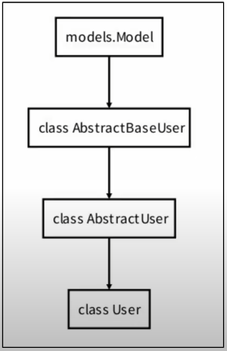

- AbstractUser  
: 관리자 권한과 함께 완전한 기능을 가지고 있는 User model을 구현하는 추상 기본클래스  
  
- AbstractUser base classes(추상 기본 클래스)  
> - 몇 가지 공통 정보를 여러 다른 모델을 넣을 때 사용하는 클래스  
> - 데이터베이스 테이블을 만드는 데 사용되지 않으며, 대신 다른 모델의 기본 클래스로 사용되는 경우 해당 필드가 하위 클래스의 필드에 추가됨  

##### [주의] 프로젝트 중간에 AUTH_USER_MODEL 변경하기  
: 결론은 처음에 진행하기  

##### 데이터베이스 초기화  
1) migrations 파일 삭제  
> migrations 폴더 및 __init__.py는 삭제하지 않는다.
> 번호가 붙은 파일만 삭제  

2) db.sqlite3 삭제  
3) migrations 진행  
> makemigrations
> migrate

새롭게 accounts에서 설계도를 만들고(makemigrations), migrate해서 테이블을 보면, 생성된 테이블이 auth_user가 아닌, accounts_user임을 알 수 있다.  

---  
### HTTP Cookies  

##### HTTP(Hyper Text Transfer Protocol)  
: HTML 문서와 같은 리소스들을 가져올 수 있도록 해주는 프로토콜(규칙, 규약)  
클라이언트 - 서버 프로토콜이라고도 부른다.  

- 요청(requests)  
: 클라이언트(브라우저)에 의해 전송되는 메시지  
  

- 응답(response)  
: 서버에서 응답으로 전송되는 메시지  
  
##### HTTP 특징  
1. 비 연결 지향 (connectionless)
: 서버는 요청에 대한 응답을 보낸 후 연결을 끊음  
   
2. 무상태 (stateless)
: 연결을 끊는 순간 클라이언트와 서버 간의 통신이 끝나며 상태 정보가 유지 되지 않는다.  
   
- 로그인 상태 유지  
: 서버와 클라이언트 간 지속적인 상태 유지를 위해 "쿠키와 세션"이 존재  
  
---  
### 쿠키(Cookie)  
: HTTP 쿠키는 상태가 있는 세션을 만들도록 해 준다.  

- 세션  
: 상태가 있는 쿠키  
  

- 쿠키  
> : 서버가 사용자의 웹 브라우저에 전송하는 작은 데이터 조각  
> =사용자가 웹사이트 방문 &rightarrow; 서버를 통해 사용자의 컴퓨터에 설치되는 작은 기록 정보 파일  
> 1. key-value의 데이터 형식으로 저장  
> 2. 동일한 서버에 재요청 시 저장된 쿠키를 함께 전송  
> 
> 쿠키는 두 요청이 동일한 브라우저에서 들어왔는지 판단할때 사용  
> - 사용자의 로그인 상태를 유지할 수 있다.  
> - 상태가 없는(stateless) HTTP 프로토콜에서 상태 정보를 기억시켜주기때문  
> 
> 즉, 웹 페이지 접속시, 응답한 서버로부터 쿠키를 받아 브라우저에 저장하고,  
> 클라이언트가 같은 서버에 재요청 시마다 요청과 함께 저장해 두었던 쿠키도 함께 전송  

- 쿠키 사용 목적  
> 1. 세션 관리(Session management)  
> : 로그인, 아이디 자동완성, 공지 하루 안 보기, 팝업 체크, 장바구니 등의 정보 관리  
> 2. 개인화(Personalization)  
> : 사용자 선호, 테마 등의 설정  
> 3. 트래킹(Tracking)  
> : 사용자 행동을 기록 및 분석  

- 세션 (Session)  
> : 사이트와 특정 부라우저 사이의 "State(상태)"를 유지시키는 것  
>   클라이언트가 서버 접속하면 서버가 session id 발급, 클라이언트는 이를 쿠키에 저장  
>  &Rightarrow; 다시 동일한 서버에 접속하면 요청과 함께 쿠키(session id가 저장된)를 서버에 전달  
> session id는 세션을 구별하기 위해 필요, 쿠키에는 session id만 저장  

- 쿠키 Lifetime(수명)  
1. Session cookie  
: 현재 세션이 종료되면 삭제됨  
   브라우저 종료와 함께 세션이 삭제됨  
   
2. Persistent cookies  
: Expires 속성에 지정된 날짜 혹은 Max-Age 속성에 지정된 기간이 지나면 삭제됨  
   
- Session in Django  
> Django는 database-backed seesions 저장 방식을 기본값으로 사용  
> - session 정보는 Django DB의 django_session 테이블 에 저장  
> 
> Django는 특정 session id를 포함하는 쿠키를 사용해서 각각의 브라우저와 사이트가 연결된 session을 알아낸다.  
> Django는 우리가 session 매커니즘에 대부분 생각하지 않게 함.  

---
### Authentication in Web requests  
Django가 제공하는 인증 관련 built-in forms 익히기  

- Login  
: 로그인은 Session을 Create하는 과정  
  
```python
# admin 계정 만들기
python manage.py createsuperuser
```

##### AuthenticationForm  
> : 로그인을 위한 built-in form  
> - 로그인 하고자 하는 사용자 정보를 입력 받음  
> - 기본적으로 username과 password를 받아 데이터가 유효한지 검증  
>
> request를 첫번째 인자로 취함  
> 
> 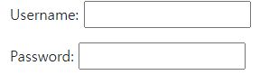  
> 와 같이 생성

---
#####  Login
- login()
> `login(request, user, backend=None)`  
> 인증된 사용자를 로그인 시키는 로직, view 함수에서 사용  
> 현재 세션에 연결하려는 인증된 사용자가 있는 경우 사용  
> HttpRequest 객체와 User 객체가 필요  

- getuser()  
> AuthenticationForm의 인스턴스 메서드  
> 유효성 검사를 통과했을 경우 로그인 한 사용자 객체를 반환  

- Login도 페이지, 인증이 필요하다. &Rightarrow; GET, POST  
```python
from django.shortcuts import render
from django.contrib.auth.forms import AuthenticationForm
from django.contrib.auth import login as auth_login

# Create your views here.
def login(request):
    if request.method == 'POST': # post로 제출했을때, 즉 로그인 했을때,
        form = AuthenticationForm(request, request.POST) # 첫번째 들어가는 인자가 request, 그 다음 정보
        # form = AuthenticationForm(request, data = request.POST) 위와 같다. 
        if form.is_valid():
            # 로그인 -> save 가 아니라 session을 만든다.
            auth_login(request, form.get_user()) # 인자 : request, 유저정보
            return redirect('articles:index')
    else:
        form = AuthenticationForm() # 인스턴스 만들고,
    context = {
        'form':form,
    }
    return render(request,'accounts/login.html', context)
```

- 현재 로그인 되어있는 유저 정보 출력하기  
  
어떻게 base 템플릿에서 context 데이터 없이 user 변수를 사용할 수 있는 걸까?  
  &rightarrow; settings.py의 context processors 설정 값 때문이다.
  

- context processors  
> 템플릿이 렌더링 될 때 호출 가능한 컨텍스트 데이터 목록  
> 작성된 컨텍스트 데이터는 기본적으로 템플릿에서 사용 가능한 변수로 포함됨  
> 즉, django에서 자주 사용하는 데이터 목록을 미리 템플릿에 로드 해 둔 것  
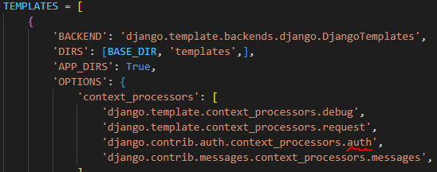    
> 현재 user 변수를 담당하는 프로세서는 django.contrib.auth.context_processors.auth  

- 현재 로그인한 사용자를 나타내는 User 클래스의 인스턴스가 템플릿 변수 `{{user}}` 에 저장된다.  
   - 클라이언트가 로그인하지 않은 경우 AnonymousUser 클래스의 인스턴스로 생성  
   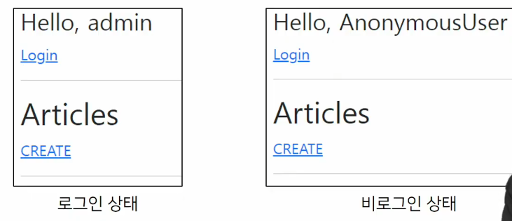  
     
--- 
##### Logout  
: 로그아웃은 Session을 Delete하는 과정  

- logout()
> `logout(request)`   
> HttpRequest 객체를 인자로 받고 반환 값이 없다.  
> 사용자가 로그인하지 않은 경우 오류를 발생시키지 않는다.  
> - 2가지 일을 처리함.  
> 1. 현재 요청에 대한 session data를 DB에서 삭제  
> 2. 클라이언트의 쿠키에서도 sessionid를 삭제  
> &Rightarrow; 이는 다른사람이 동일한 웹 브라우저를 사용하여 로그인하고,  
> 이전 사용자의 세션 데이터에서 엑세스하는 것을 방지하기 위함.  

>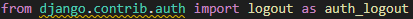  
>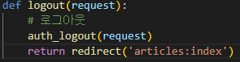  
---
### Authentication with User  
User Object 와 User CRUD에 대한 이해  
- 회원 가입, 회원 탈퇴, 회원정보 수정, 비밀번호 변경  

##### 회원 가입  
: 회원가입은 User를 Create하는 것, UserCreationForm built-in form을 사용  

- UserCreationForm  
> 주어진 username과 password로 권한이 없는 새 user를 생성하는 ModelForm  
> - 3개의 필드를 가진다.  
>   1) username
>   2) password1
>   3) password2  

> 먼저 urls.py, signup.html, views.py 작성하고,  
> base.html에 회원가입 링크 작성했다.  
> 회원가입 로직까지 작성하였다.
> 
>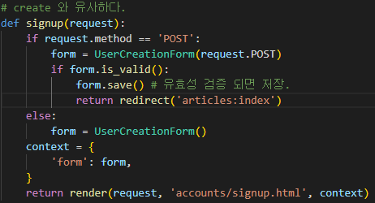  
> 위와 같이 views.py에서 함수 만들고, base.html, signup.html을 꾸미고, 회원가입 하면,  
> 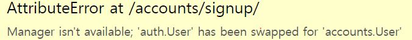  
> 과 같은 에러가 뜬다.

- 에러 해결  

>UserCreationForm은 ModelForm이다.  
>ModelForm 내부에서는 새로만든 accounts.User가 아닌 auth.User로 계속 생성된다.  
>이는 class 내부를 뜯어보면,   
>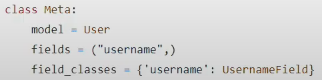  
>와 같이 model이 User로 지정되어 있다.  
>
>새로 클래스를 만들어서 정의해준다.  
>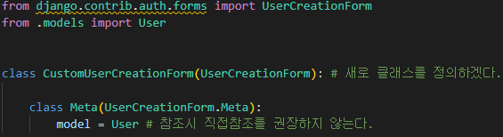    
>이때, 위와 같이 직접 참조 해줄수는 있지만, 이를 권장하지 않고 함수를 지원해줘서 아래와 같이 코드를 작성 한다.
>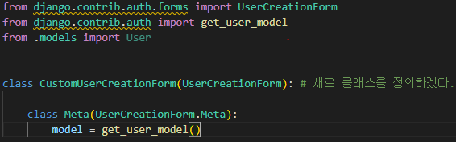    
> ##### Django는 User를 직접참조하는것을 좋아하지 않는다.  
```python
# views.py  
# create 와 유사하다.
def signup(request):
    if request.method == 'POST':
        form = CustomUserCreationForm(request.POST) # 만들어준 클래스로 변경
        if form.is_valid(): 
            form.save() # 유효성 검증 되면 저장.
            return redirect('articles:index')
    else:
        form = CustomUserCreationForm()
    context = {
        'form': form,
    }
    return render(request, 'accounts/signup.html', context)
```
---
### Custom user & Built-in auth forms  
- AbstractBaseUser의 모든 subclass와 호환되는 forms
> - 아래 Form 클래스는 User 모델을 대체하더라도 커스텀 하지 않아도 사용가능  
>   1. AuthenticationForm
>   2. SetPasswordForm
>   3. PasswordChangeForm
>   4. AdminPasswordChangeForm  
> 
> &rightarrow; 기존 User 모델을 참조하는 Form이 아니다.  

> - 커스텀 유저 모델을 사용하려면 다시 작성하거나 확장해야 하는 forms  
>   1. UserCreationForm # 회원가입  
>   2. UserChangeForm # 회원정보수정  
> 
> &Rightarrow; 두 form 모두 class Meta: model = User 가 등록된 form이기 때문에 반드시 커스텀(확장)해야 한다.

- 미리 커스텀 하기.
```python
# accounts/forms.py
from django.contrib.auth import get_user_model
from django.contrib.auth.forms import UserCreationForm, UserChangeForm


class CustomUserCreationForm(UserCreationForm): # 새로 클래스를 정의하겠다.

    class Meta(UserCreationForm.Meta):
        model = get_user_model()

class CustomUserChangeForm(UserChangeForm):
    class Meta(UserChangeForm.Meta):
        model = get_user_model()
``` 
  
- get_user_model()  
    - "현재 프로젝트에서 활성화된 사용자 모델"을 반환  
    - 직접 참조하지 않는 이유  
    : 기존 User 가 아닌 모델을 커스텀 한 상황에서는 커스텀 User 모델을 자동으로 반환해주기 때문이다.
    - Django는 User 클래스를 직접 참조하는 대신 `get_user_model()`을 사용해 참조해야 한다.  
    

- 회원가입 후에 로그인 상태  
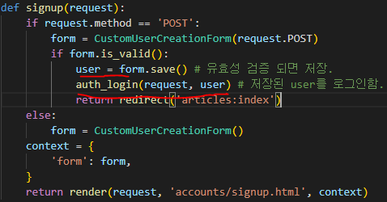  
  
---
##### 회원탈퇴  

```python
# urls.py
urlpatterns = [
    path('delete/',views.delete, name='delete'),]

# views.py
def delete(request): # 지금 request밖에 없고, 거기에 정보가 있다.
    request.user.delete()
    return redirect('articles:index')

# base.html
<form action="  " method="POST">
  
  <input type="submit" value="회원탈퇴">
</form>
```
&Rightarrow; 회원탈퇴시 user는 없어지지만, Session이 남아있는다.  
```python
# 꼭 삭제후, 로그아웃을 한다. 로그아웃을 먼저하면 삭제할 user에 대한 정보를 모르므로 삭제가 안된다.

def delete(request): # 지금 request밖에 없고, 거기에 정보가 있다.
    request.user.delete()
    auth_logout(request) # 로그아웃을 하지 않으면, session이 남아있으므로, 로그아웃.
    return redirect('articles:index')
```
---
##### 회원정보 수정  
: 회원정보 수정은 User를 Update 하는 것이며 UserChangeForm built-in form을 사용  

- UserChangeForm  
> - 사용자의 정보 및 권한을 변경하기 위해 admin 인터페이스에서 사용되는 ModelForm  
> - ModelForm이기 때문에 instance 인자로 기존 user 데이터 정보를 받는 구조 또한 동일하다.  
> - 이미 이전에 CustomUserChangeForm 확장했기때문에, 사용하자.  

```python
# urls.py
path('update/',views.update, name='update'),]

# views.py
def update(request):
    if request.method == 'POST':
        pass
    else:
        form = CustomUserChangeForm(instance= request.user) # 변경은 instance
    context = {
        'form': form,
    }
    return render(request, 'accounts/update.html', context)

# update.html 생성

# base.html

<a href="  ">회원정보수정</a>
```
홈페이지 확인하면, 권한마저 줄수있는 문제점 발생  
: admin 인터페이스에서 사용되는 ModelForm  
&rightarrow; CustomUserChangeForm의 fields 제한.  
```python
# accounts/forms.py  

class CustomUserChangeForm(UserChangeForm):

    class Meta(UserChangeForm.Meta):
        model = get_user_model()
        fields = ('email','first_name','last_name',)
```
이때, 비밀번호 변경은 다른 곳에서 변경  

```python
# update 함수
def update(request):
    if request.method == 'POST':
        form = CustomUserChangeForm(request.POST, instance=request.user)
        if form.is_valid():
            form.save()
            return redirect('articles:index')
    else:
        form = CustomUserChangeForm(instance= request.user) # 변경은 instance
    context = {
        'form': form,
    }
    return render(request, 'accounts/update.html', context)
```
---
##### 비밀번호 변경  
- PasswordChangeForm  
    - 사용자가 비밀번호를 변경할 수 있도록 하는 Form
    - 이전 비밀번호를 입력하여 비밀번호 변경 가능  
    - 이전 비밀번호를 입력하지 않고, 설정할 수 있는 `SetPasswordForm`을 상속받는 서브 클래스  
    

- 처음으로 함수와 url이 이름과 다르게 만든다.
```python
# urls.py
path('password/', views.change_password, name='change_password'),

# views.py
def change_password(request):
    if request.method == 'POST':
        pass
    else:
        form = PasswordChangeForm(request.user) # 기존과 다르게 user 인자를 받는다.
    context = {
        'form': form,
    }
    return render(request, 'accounts/change_password.html',context)

# change_password.html도 생성
```

password 함수 로직 작성  
```python
def change_password(request):
    if request.method == 'POST':
        form = PasswordChangeForm(request.user, request.POST)
        if form.is_valid():
            form.save()
            return redirect('articles:index')
    else:
        form = PasswordChangeForm(request.user) # 기존과 다르게 user 인자를 받는다.
    context = {
        'form': form,
    }
    return render(request, 'accounts/change_pass
```
비밀번호 변경후 로그아웃이 된다.  
&rightarrow; 세션 무효화가 된다.

- update_session_auth_hash()  
    - update_session_auth_hash(request, user)
    - 현재 요청과 새 session data가 파생 될 업데이트 된 사용자 객체를 가져오고, session data를 적절하게 업데이트 해준다.  
    - 암호가 변경되어도 로그아웃 되지 않도록 새로운 password의 session data로 session 업데이트  
    
```python
from django.contrib.auth import update_session_auth_hash

def change_password(request):
    if request.method == 'POST':
        form = PasswordChangeForm(request.user, request.POST)
        if form.is_valid():
            form.save()
            update_session_auth_hash(request, form.user) # 호출하고 넣기보다는, 반환값으로 공식문서에서 사용
            return redirect('articles:index')
    else:
        form = PasswordChangeForm(request.user) # 기존과 다르게 user 인자를 받는다.
    context = {
        'form': form,
    }
    return render(request, 'accounts/change_password.html',context)
```
---
### Limiting access to logged-in users  
: 로그인 사용자에 대한 접근 제한 (2가지)  
1. The raw way  
    - `is_authenticated` attribute
    
2. The `login_required` decorator  

- is_authenticated  
> User model의 속성중 하나  
> 사용자가 인증 되었는지 여부를 알 수 있는 방법  
> User 인스턴스에 대해 항상 True  
> AnonymousUser에 대해서 항상 False  
> 일반적으로 request.user에서 속성 사용  
> &rightarrow; request.user.is_authenticated
> 로그인/ 비로그인만 확인하고, 다른 상태에 대해서는 확인하지 않는다.  
> ex) 권한, 활성화 상태, 유효한 세션을 확인하지 않음.  

- base.html 정리  
```html
<!DOCTYPE html>
<html lang="en">
<head>
  <meta charset="UTF-8">
  <meta http-equiv="X-UA-Compatible" content="IE=edge">
  <meta name="viewport" content="width=device-width, initial-scale=1.0">
  <link href="https://cdn.jsdelivr.net/npm/bootstrap@5.2.0/dist/css/bootstrap.min.css" rel="stylesheet" integrity="sha384-gH2yIJqKdNHPEq0n4Mqa/HGKIhSkIHeL5AyhkYV8i59U5AR6csBvApHHNl/vI1Bx" crossorigin="anonymous">  <title>Document</title>
</head>
<body>
  <div class="container">
    
      <h3>{{ user }}</h3>
      <form action="  " method="POST">
        
        <input type="submit" value="Logout"> 
      </form>
      <form action="  " method="POST">
        
        <input type="submit" value="회원탈퇴">
      </form>
      <a href="  ">회원정보수정</a>
    
      <a href="">Login</a>
      <a href="  ">Signup</a>
    
    
    <hr>
    
    
  </div>
  <script src="https://cdn.jsdelivr.net/npm/bootstrap@5.2.0/dist/js/bootstrap.bundle.min.js" integrity="sha384-A3rJD856KowSb7dwlZdYEkO39Gagi7vIsF0jrRAoQmDKKtQBHUuLZ9AsSv4jD4Xa" crossorigin="anonymous"></script>
</body>
</html>
```
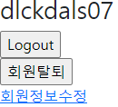  
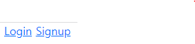  
와 같이 정리되지만, login해도, url만 알면 login 페이지로 넘어올 수 있다.  
&rightarrow; 근본적으로 정리된 것은 아니다.  

```python
# views.py
def login(request):
    if request.user.is_authenticated: # 인증된 사용자라면,
        return redirect('articles:index')
    ...
```
위와 같이 제일 먼저 if 문으로 넘어가지 않게 설정해주면 된다.  

logout 상태에서 create 안보이게 처리  
```html
<h1>Articles</h1>

<a href="">CREATE</a>

```
---
- login_required  
@login_required를 사용
  
```python
# articles/views.py
from django.contrib.auth.decorators import login_required  

@login_required
@require_http_methods(['GET', 'POST'])
def create(request):
    ...

@login_required
@require_POST
def delete(request, pk):
    ...

@login_required
@require_http_methods(['GET', 'POST'])
def update(request, pk):
    ...
```  
- decorator 페이지 이동시  
로그인 상태로 decorator가 붙어있는 페이지를 접속 &rightarrow; 정상적으로 함수 실행  
비로그인 상태로 접속 &rightarrow; /accounts/login/ 으로 이동 (기본값)  

이때, url 확인시 /accounts/login/?next=/...으로 되어있고,  
로그인해도, redirect로 가지 않는다.  
&Rightarrow; form의 action을 비워준다.  

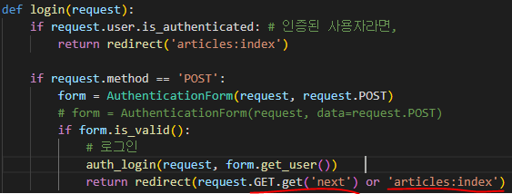  
views.py의 login 함수를 위와 같이 수정한다.  
결국, key=value 값으로 url을 지목해줘야 가는데, key가 next가 되고, valuse가 request.GET.get('next')가 된다.  

---
- 두 데코레이더 에러  
```python
# articles/views.py

@login_required
@require_POST
def delete(request, pk):
    article = Article.objects.get(pk=pk)
    article.delete()
    return redirect('articles:index')
```
비로그인 상태에서 delete 요청시, login 페이지로 온다.  
login 성공시 @require_POST를 처리하는데, @login_required가 GET 방식을 사용.  
&Rightarrow; 405 error 발생  

- 해결 방법  
```python
@require_POST
def delete(request, pk):
    if request.user.is_authenticated:
        article = Article.objects.get(pk=pk)
        article.delete()
    return redirect('articles:index')
```
POST method만 허용하는 delete 함수는 내부에서 is_authenticated로 해결  
다른 함수는 전부 가능  

&rightarrow; articles/views.py에만 데코레이터 및 속성 값 적용했다.  

&Rightarrow; accounts/views.py에도 적용시키기.  
```python
# accounts/views.py
from django.contrib.auth.decorators import login_required
from django.views.decorators.http import require_POST, require_http_methods

@require_http_methods(['GET','POST'])
def login(request):
    ...

@require_POST
def logout(request):
    ...

@require_http_methods(['GET','POST'])
def signup(request):
    ...

@login_required
@require_http_methods(['GET','POST'])
def update(request):
    ...

@login_required
@require_http_methods(['GET','POST'])
def change_password(request):
    ...
```


