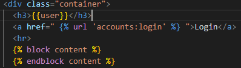

# Django 05

### Index  
> - The Django authentication system
> - HTTP Cookies
> - Authentication in Web requests
> - Authentication with User
> - Limiting access to logged-in users

### The Django authentication system  
: 장고 인증 시스템  
인증(Authentication)과 권한(Authorization) 부여  
필수 구성은 settings.py에 이미 포함  

- Authentication (인증)  
- Authorization (권한, 허가)

#### Substituting a custom User model  

"Custom User model"로 기존 built-in User model 을 대체하자.  
`AUTH_USER_MODEL` 설정 값으로 Default User Model을 재정의(override)할 수 있다.  

- 기본 값  
```python
# settings.py  
AUTH_USER_MODEL = 'auth.User'
```
#### How to Substituting a custom User model    

3단계로 나뉜다.  

1) AbstractUser를 상속받는 커스텀 User 클래스 작성  
```python
# accounts/models.py  

from django.contrib.auth.models import AbstractUser

class User(AbstractUser): 
    pass
```

2) Django 프로젝트에서 방금 생성한 커스텀 User 모델 지정  

```python
# settings.py  
AUTH_USER_MODEL = 'accounts.User'
```

3) admin.py에 커스텀 User 모델을 등록  
```python
from django.contrib import admin
from django.contrib.auth.admin import UserAdmin
from .models import User

admin.site.register(User, UserAdmin) # admin.site.등록한다()
```

##### [참고] User 모델 상속 관계  


- AbstractUser  
: 관리자 권한과 함께 완전한 기능을 가지고 있는 User model을 구현하는 추상 기본클래스  
  
- AbstractUser base classes(추상 기본 클래스)  
> - 몇 가지 공통 정보를 여러 다른 모델을 넣을 때 사용하는 클래스  
> - 데이터베이스 테이블을 만드는 데 사용되지 않으며, 대신 다른 모델의 기본 클래스로 사용되는 경우 해당 필드가 하위 클래스의 필드에 추가됨  

##### [주의] 프로젝트 중간에 AUTH_USER_MODEL 변경하기  
: 결론은 처음에 진행하기  

##### 데이터베이스 초기화  
1) migrations 파일 삭제  
> migrations 폴더 및 __init__.py는 삭제하지 않는다.
> 번호가 붙은 파일만 삭제  

2) db.sqlite3 삭제  
3) migrations 진행  
> makemigrations
> migrate

새롭게 accounts에서 설계도를 만들고(makemigrations), migrate해서 테이블을 보면, 생성된 테이블이 auth_user가 아닌, accounts_user임을 알 수 있다.  

---  
### HTTP Cookies  

##### HTTP(Hyper Text Transfer Protocol)  
: HTML 문서와 같은 리소스들을 가져올 수 있도록 해주는 프로토콜(규칙, 규약)  
클라이언트 - 서버 프로토콜이라고도 부른다.  

- 요청(requests)  
: 클라이언트(브라우저)에 의해 전송되는 메시지  
  

- 응답(response)  
: 서버에서 응답으로 전송되는 메시지  
  
##### HTTP 특징  
1. 비 연결 지향 (connectionless)
: 서버는 요청에 대한 응답을 보낸 후 연결을 끊음  
   
2. 무상태 (stateless)
: 연결을 끊는 순간 클라이언트와 서버 간의 통신이 끝나며 상태 정보가 유지 되지 않는다.  
   
- 로그인 상태 유지  
: 서버와 클라이언트 간 지속적인 상태 유지를 위해 "쿠키와 세션"이 존재  
  
---  
### 쿠키(Cookie)  
: HTTP 쿠키는 상태가 있는 세션을 만들도록 해 준다.  

- 세션  
: 상태가 있는 쿠키  
  

- 쿠키  
> : 서버가 사용자의 웹 브라우저에 전송하는 작은 데이터 조각  
> =사용자가 웹사이트 방문 &rightarrow; 서버를 통해 사용자의 컴퓨터에 설치되는 작은 기록 정보 파일  
> 1. key-value의 데이터 형식으로 저장  
> 2. 동일한 서버에 재요청 시 저장된 쿠키를 함께 전송  
> 
> 쿠키는 두 요청이 동일한 브라우저에서 들어왔는지 판단할때 사용  
> - 사용자의 로그인 상태를 유지할 수 있다.  
> - 상태가 없는(stateless) HTTP 프로토콜에서 상태 정보를 기억시켜주기때문  
> 
> 즉, 웹 페이지 접속시, 응답한 서버로부터 쿠키를 받아 브라우저에 저장하고,  
> 클라이언트가 같은 서버에 재요청 시마다 요청과 함께 저장해 두었던 쿠키도 함께 전송  

- 쿠키 사용 목적  
> 1. 세션 관리(Session management)  
> : 로그인, 아이디 자동완성, 공지 하루 안 보기, 팝업 체크, 장바구니 등의 정보 관리  
> 2. 개인화(Personalization)  
> : 사용자 선호, 테마 등의 설정  
> 3. 트래킹(Tracking)  
> : 사용자 행동을 기록 및 분석  

- 세션 (Session)  
> : 사이트와 특정 부라우저 사이의 "State(상태)"를 유지시키는 것  
>   클라이언트가 서버 접속하면 서버가 session id 발급, 클라이언트는 이를 쿠키에 저장  
>  &Rightarrow; 다시 동일한 서버에 접속하면 요청과 함께 쿠키(session id가 저장된)를 서버에 전달  
> session id는 세션을 구별하기 위해 필요, 쿠키에는 session id만 저장  

- 쿠키 Lifetime(수명)  
1. Session cookie  
: 현재 세션이 종료되면 삭제됨  
   브라우저 종료와 함께 세션이 삭제됨  
   
2. Persistent cookies  
: Expires 속성에 지정된 날짜 혹은 Max-Age 속성에 지정된 기간이 지나면 삭제됨  
   
- Session in Django  
> Django는 database-backed seesions 저장 방식을 기본값으로 사용  
> - session 정보는 Django DB의 django_session 테이블 에 저장  
> 
> Django는 특정 session id를 포함하는 쿠키를 사용해서 각각의 브라우저와 사이트가 연결된 session을 알아낸다.  
> Django는 우리가 session 매커니즘에 대부분 생각하지 않게 함.  

---
### Authentication in Web requests  
Django가 제공하는 인증 관련 built-in forms 익히기  

- Login  
: 로그인은 Session을 Create하는 과정  
  
```python
# admin 계정 만들기
python manage.py createsuperuser
```

##### AuthenticationForm  
> : 로그인을 위한 built-in form  
> - 로그인 하고자 하는 사용자 정보를 입력 받음  
> - 기본적으로 username과 password를 받아 데이터가 유효한지 검증  
>
> request를 첫번째 인자로 취함  
> 
>   
> 와 같이 생성

---
#####  Login
- login()
> login(request, user, backend=None)  
> 인증된 사용자를 로그인 시키는 로직, view 함수에서 사용  
> 현재 세션에 연결하려는 인증된 사용자가 있는 경우 사용  
> HttpRequest 객체와 User 객체가 필요  

- getuser()  
> AuthenticationForm의 인스턴스 메서드  
> 유효성 검사를 통과했을 경우 로그인 한 사용자 객체를 반환  

- Login도 페이지, 인증이 필요하다. &Rightarrow; GET, POST  
```python
from django.shortcuts import render
from django.contrib.auth.forms import AuthenticationForm
from django.contrib.auth import login as auth_login

# Create your views here.
def login(request):
    if request.method == 'POST': # post로 제출했을때, 즉 로그인 했을때,
        form = AuthenticationForm(request, request.POST) # 첫번째 들어가는 인자가 request, 그 다음 정보
        # form = AuthenticationForm(request, data = request.POST) 위와 같다. 
        if form.is_valid():
            # 로그인 -> save 가 아니라 session을 만든다.
            auth_login(request, form.get_user()) # 인자 : request, 유저정보
            return redirect('articles:index')
    else:
        form = AuthenticationForm() # 인스턴스 만들고,
    context = {
        'form':form,
    }
    return render(request,'accounts/login.html', context)
```

- 현재 로그인 되어있는 유저 정보 출력하기  

어떻게 base 템플릿에서 context 데이터 없이 user 변수를 사용할 수 있는 걸까?  
  &rightarrow; settings.py의 context processors 설정 값 때문이다.
  

- context processors  
> 템플릿이 렌더링 될 때 호출 가능한 컨텍스트 데이터 목록  
> 작성된 컨텍스트 데이터는 기본적으로 템플릿에서 사용 가능한 변수로 포함됨  
> 즉, django에서 자주 사용하는 데이터 목록을 미리 템플릿에 로드 해 둔 것  
    
> 현재 user 변수를 담당하는 프로세서는 django.contrib.auth.context_processors.auth  

- 현재 로그인한 사용자를 나타내는 User 클래스의 인스턴스가 템플릿 변수 `{{user}}` 에 저장된다.  
   - 클라이언트가 로그인하지 않은 경우 AnonymousUser 클래스의 인스턴스로 생성  
     
     
--- 
##### Logout  
: 로그아웃은 Session을 Delete하는 과정  


  


