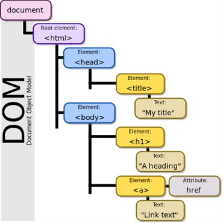
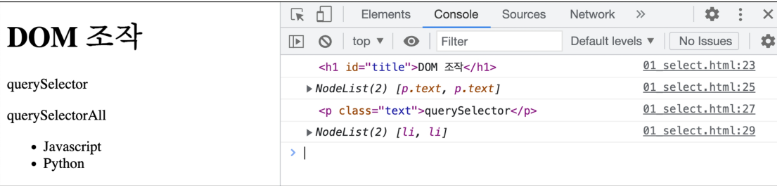
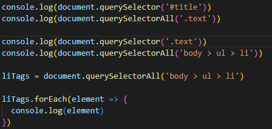
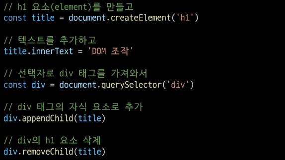
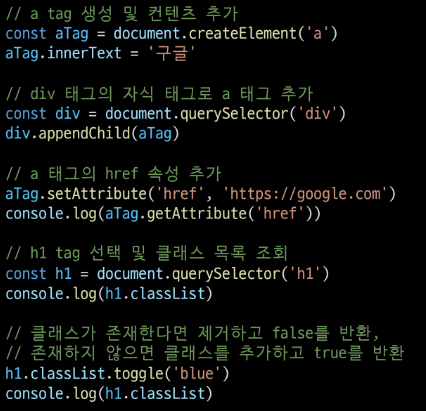

# 1024 JavaScript 심화  

---  
### INDEX  
> - DOM  
> - Event  
> - this  

---  
### DOM  
브라우저에서의 JS는 웹페이지에서 복잡한 기능을 구현하는 스크립트 언어  

#### Browser APIs  
: 웹 브라우저에 내장된 API, 현재 컴퓨터 환경에 관한 데이터를 제공하거나 여러가지 유용하고 복잡한 일을 수행  
&rightarrow; DOM이 종류중 하나이다.  

- DOM(Document Object Model)  
: 문서 객체 모델  
  문서의 구조화된 표현을 제공, 프로그래밍 언어가 DOM 구조에 접근할 수 있는 방법을 제공  
  HTML/CSS 조작 가능  
  문서가 구조화되어 있고, 각 요소는 객체(object)로 취급  
  프로그래밍 언어적 특성을 활용한 조작 가능  
  
  - DOM은 문서를 논리 트리로 표현  
      
    DOM 메서드를 사용하면 프로그래밍적으로 트리에 접근할 수 있고 이를 통해 문서의 구조, 스타일, 컨텐츠를 변경할 수 있다.  
      
  - 웹 페이지는 일종의 문서(document)  
  - DOM은 동일한 문서를 표현하고, 저장하고, 조작하는 방법을 제공  
  - DOM은 웹 페이지의 객체 지향 표현, JS와 같은 스크립트 언어를 이용해 DOM 수정 가능  
      

- DOM의 주요 객체  
  - window  
  - document
  - navigator, location, history, screen 등  
    

`window` object  
: DOM을 표현하는 창  
가장 최상위 객체  
탭 기능이 있는 브라우저에서는 각각의 탭을 각각의 window 객체로 나타낸다.  

- window의 메서드  
  - 새 탭 열기  
  `window.open()`  
    
  - 경고 대화 상자 표시  
  `window.print()`  
    
  - 인쇄 대화 상자 표시  
  `window.alert()`  
    
- `document` object  
: 브라우저가 불러온 웹 페이지  
  페이지 컨텐츠의 진입점 역할을 하며, <body> 등과 같은 수많은 다른 요소들을 포함  
  
  - `document` 속성 예시  
    - 현재 문서의 제목  
    `document.title`  
      
    - 제목 수정  
    `document.title = 'JavaScript'`

    +) document는 window의 속성이다.  
  
- 파싱 (Parsing)  
: 구문 분석, 해석  
  브라우저가 문자열을 해석하여 DOM Tree로 만드는 과정  
  
---  
#### DOM 조작  

- 조작 순서  
  - 선택(Select)  
  - 조작(Manipulation)  
    - 생성, 추가, 삭제 등등  
  
#### 선택 관련 메서드  

- `document.querySelector(selecor)`  
  - 제공한 선택자와 일치하는 element 한 개 선택  
  - CSS selector를 만족하는 첫 번째 element 객체 반환(없으면 null 반환)  
  
- `document.querySelectorAll(selecor)`  
  - 제공한 선택자와 일치하는 여러 element 선택  
  - 매칭 할 하나 이상의 셀렉터를 포함하는 유효한 CSS selector를 인자(문자열)로 받는다.  
  - CSS selector를 만족하는 NodeList를 반환  
  
  
  

id를 검색해서 선택할때는 '#{id}'  
class를 검색해서 선택할때는 '.{class}'  
querySelector('')는 가장 먼저 해당하는 값이 선택된다.  

- NodeList  
: index로만 각 항목에 접근 가능  
  forEach 메서드 및 배열 메서드 사용 가능  
  
---  
#### 조작 관련 메서드 (생성)  
- `document.createElement(tagName)`  
: 작성한 tagName의 HTML 요소를 생성하여 반환  
  
---  
#### 조작 관련 메서드 (입력)  
- `Node.innerText`  
: Node 객체와 그 자손의 텍스트 컨텐츠(DOMString)를 표현  
  사람이 읽을 수 있는 요소만 남긴다.  
  최종적으로 스타일링에 적용된 모습으로 표현  
  
- `Node.appendChild()`  
: 한 Node를 특정 부모 Node의 자식 NodeList 중 마지막 자식으로 삽입  
  한번에 오직 하나의 Node만 추가할 수 있다.  
  추가된 Node 객체를 반환  
  만약 주어진 Node가 이미 문서에 존재하는 다른 Node를 참조한다면, 현재 위치에서 새로운 위치로 이동  
  
- `Node.removeChile()`  
: DOM에서 자식 Node를 제거후 반환  
  
  
h1 태그를 생성하고, innerText로 내용을 넣어줬다.  
기존 body에 있는 div 태그를 선택한 후에, title을 추가하면 출력된다.  
요소를 삭제하면 안보인다.  

---  
#### 조작 관련 메서드(속성 조회 및 설정)  
- `Element.getAttribute(attributeName)`  
: 해당 요소의 지정된 값(문자열)을 반환  
  인자(attributeName)는 값을 얻고자 하는 속성의 이름  
  
- `Element.setAttribute(name, value)`  
: 지정된 요소의 값을 설정  
  속성이 이미 존재하면 값을 갱신, 존재하지 않으면 지정된 이름과 값으로 새 속성 추가  
  
   
  
a태그 만들고, 값넣고,  
div에 추가  
href 속성에 추가하고 조회  
h1 태그 classList 조회 후, toggle('blue')  

toggle은 인자로 있는 클래스가 존재하면 제거, 없으면 추가 해주는 메서드  

---  
### Event  
: 프로그래밍하고 있는 시스템에서 일어나느 사건(action) 혹은 발생(occurrence)  
우리가 원하는 대로 응답할 수 있도록 시스템이 말해주는 것  
ex) 키보드 키 입력, 브라우저 닫기, 데이터 제출, 텍스트 복사 등  

- `Event` object  
: 네트워크 활동이나 사용자와의 상호작용 같은 사건의 발생을 알리기 위한 객체  
  
  - Event 발생  
    - 마우스를 클릭하거나 키보드를 누르는 등 사용자 행동으로 발생가능  
    - 특정 메서드를 호출하여 프로그래밍적으로도 만들어 낼 수 있음.  
  
  - DOM 요소는 Event를 받고("수신")  
  - 받은 Event를 "처리"할 수 있음  
    - Event 처리는 주로 `addEventListener()`라는 Event 처리기(Event handler)를 사용해 다양한 html요소에 "부착"하게 된다.  

  

    

