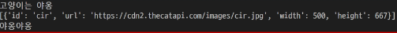
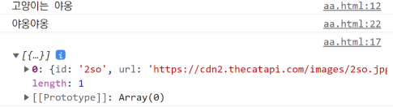

# JavaScript 10/26  

---  
### INDEX  
> - 동기와 비동기  
> - JavaScript의 비동기 처리  
> - Axios 라이브러리  
> - Callback과 Promise  
> - AJAX  


---  
### 동기와 비동기  

#### - 동기(Synchronous)  
: 모든 일을 순서대로 하나씩 처리하는 것  
Python 코드의 방식  
```html
<!DOCTYPE html>
<html lang="en">
<head>
  <meta charset="UTF-8">
  <meta http-equiv="X-UA-Compatible" content="IE=edge">
  <meta name="viewport" content="width=device-width, initial-scale=1.0">
  <title>Document</title>
</head>
<body>
  <button>버튼</button> 
  <script>
    const btn = document.querySelector('button')
    btn.addEventListener('click', () => {
      alert('you clicked me!')
      const pElem = document.createElement('p')
      pElem.innerText = 'p Element'
      document.body.appendChild(pElem)
  })
  </script>
</body>
</html>
```  

#### - 비동기(Asynchronous)  
: 결과를 기다리지않고 다음 작업을 처리하는 것(병렬적 수행)  
```html
<!DOCTYPE html>
<html lang="en">
<head>
  <meta charset="UTF-8">
  <meta http-equiv="X-UA-Compatible" content="IE=edge">
  <meta name="viewport" content="width=device-width, initial-scale=1.0">
  <title>Document</title>
</head>
<body>
  <script>
    console.log('Hi')

    setTimeout(function () {
      console.log('SSAFY')
    }, 3000)

    console.log('Bye')
  </script>
</body>
</html>
```  

- 비동기(Asynchronous)를 사용하는 이유  
: 비동기로 처리시 먼저 처리되는 부분부터 보여줄 수 있으므로, 긍정적인 효과 볼 수 있다.  
  
#### JavaScript의 비동기 처리  
JavaScript는 Single Thread 언어이다.  
- Thread란?  
: 작업을 처리할 때 시제로 작업을 수행하는 주체  
  
비동기로 처리하기 위해 어떻게 해야할까?  
Runtime : 특정 언어가 동작할 수 있는 환경  

Js에서 비동기 관련 작업은 Browser 또는 Node 환경에서 처리  
크게 아래와 같이 구성됬다.  
  1. Js Enging의 `Call Stack`  
  2. `Web API`  
  3. `Task Queue`  
  4. `Event Loop`  

- 비동기 처리 동작 방식  
  1. 모든 작업은 Call Stack(Last In First Out)으로 들어간 후 처리된다.  
  2. 오래 걸리는 작업이 Call Stack으로 들어오면 Web API로 보내서 처리  
  3. Web API에서 처리가 끝난 작업들은 Task Queue(FIFO)에 순서대로 들어간다.   
  4. Event Loop가 Call Stack이 비어 있는 것을 체크, Task Queue에서 가장 오래된 작업을 Call Stack으로 보낸다.  
    
- Call Stack  
: 요청이 들어올 때 마다 순차적으로 처리하는 Stack(LIFO)  
  
- Web API  
: JS 엔진이 아닌 브라우저에서 제공하는 runtime 환경으로 시간이 소요되는 작업을 처리  
  
- Task Queue  
: 비동기 처리된 Callback 함수가 대기하는 Queue(FIFO)  
  
- Event Loop  
: Call Stack과 Task Queue를 지속적으로 모니터링  
  Call Stack이 비어있다면 Task Queue에서 대기 중인 오래된 작업을 Call Stack으로 Push  
  
---  
### Axios 라이브러리  
: JavaScript의 HTTP 웹 통신을 위한 라이브러리  
node에서는 npm을 이용해서 설치후 사용, browser에서는 CDN을 이용해서 사용 가능  

#### Axios 기본 구조  
get, post등 여러 method 사용가능  
then 이용해서 성공하면 수행할 로직 작성  
catch 이용해서 실패하면 수행할 로직 작성  

```html
<script src="https://cdn.jsdelivr.net/npm/axios/dist/axios.min.js"></script>
<script>  
  axios.get('요청할 URL')
    .then(성공하면 수행할 콜백함수)
    .catch(실패하면 수행할 콜백함수)
</script>
```

```python
import requests 

print('고양이는 야옹')

cat_image_search_url = 'https://api.thecatapi.com/v1/images/search'
response = requests.get(cat_image_search_url)

if response.status_code == 200:
    print(response.json())
else: 
    print('실패했다옹')
    
print('야옹야옹')
```  
  

```html
<script src="https://cdn.jsdelivr.net/npm/axios/dist/axios.min.js"></script>
<script>
  console.log('고양이는 야옹')
  const catImageSearchURL = 'https://api.thecatapi.com/v1/images/search'
  const btn = document.querySelector('button')

  btn.addEventListener('click', function () {
    axios.get(catImageSearchURL)
      .then((response) => {
        imgElem = document.createElement('img')
        imgElem.setAttribute('src', response.data[0].url)
        document.body.appendChild(imgElem)
      })
      .catch((error) => { 
        console.log('실패했다옹')
      })
      console.log('야옹야옹') 
  })
</script>
```   
  
동기식(python), 비동기식(Js)  


