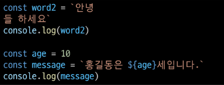
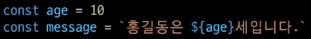

# JavaScript  

### javaScript  
: HTML 문서의 콘텐츠를 동적으로 변경할 수 있는 언어  

웹 브라우저  
&rightarrow; HTML/CSS/JavaScript 해석해서 화면으로 보여준다.  
웹 페이지 코드를 이해하고, 보여주는 역할  

#### JavaScript 시작하기  
1. Web Browser로 실행하기  
    HTML 파일에 포함시키기  
   외부 JavaScript 파일 사용하기  
   Web Browser에서 바로 입력하기  
   
2. Node.JavaScript로 실행하기  


- Web Browser  
  
  Chrome 개발자 도구 (F12) - Console 탭  
  
node.js 설치 후 확인하기  
`node -v
npm -v`  
실행하기  
`node hello_js`  

python 에서 print(x)와 같은 출력문  
&Rightarrow; `console.log(x)`

---  
### JavaScript 기초 문법  

- 세미콜론(semicolon)  
선택적으로 사용, 없으면 ASI에 의해 자동으로 삽입된다.  
  ASI(Automatic Semicolon Insertion): 자동 세미콜론 삽입 규칙  
  
-들여쓰기, 코드 블럭  
js는 2칸 들여쓰기 사용  
블럭(block)은 if, for, 함수에서 중괄호 `{}` 내부를 말한다.  

- 주석  
한줄 주석(//), 여러 줄(/* */) 주석  
  
---  
#### 변수와 식별자  
- 식별자  
: 변수를 구분할 수 있는 변수명  
  문자,$,_로 반드시 시작해야한다.  
  대소문자 구분하고, 클래스명 외에는 모두 소문자로 시작한다.  
  예약어 사용 불가능  
  
- 식별자 정의와 특징  
> - 카멜 케이스(camelCase)  
> : 변수, 객체, 함수에 사용  
> 
> - 파스칼 케이스(PascalCase)  
> : 클래스, 생성자에 사용  
> 
> - 대문자 스네이크 케이스(SNACE_CASE)  
> : 상수(constants)에 사용  
> 상수 : 개발자의 의도와 상관없이 변경될 가능성이 없는 값  

- 변수 선언 키워드  
> 1. let  
> : 블록 스코프 지역 변수 선언(동시에 초기화)  
> 
> 2. const  
> : 블록 스코프 읽기 전용 상수를 선언(동시에 초기화)  
> 
> 3. var  
> : 변수 선언(동시에 초기화)  

- 선언, 할당, 초기화  
  - 선언(Declaration)  
    : 변수 생성하는 행위 또는 시점  
    
  - 할당(Assignment)  
    : 선언된 변수에 값을 저장하는 행위 또는 시점  
    
  - 초기화(Initialzation)  
    : 선언된 변수에 처음으로 값을 저장한느 행위 또는 시점  
    

- 블록 스코프(block scope)  
: 중괄호 내부를 가리킨다.  
  
- const  
: 재할당 불가능 & 재선언 불가능  
  
- 호이스팅(hoisting)  
: 변수를 선언 이전에 참조할 수 있는 현상  
  
  

---  
#### 데이터 타입  
크게 원시 타입(Primitive type), 참조 타입(Reference type)으로 분류된다.  

- Number  
: 정수, 실수형 숫자를 표현하는 자료형  
  
- NaN  
: Not-A-Number(숫자가 아님)  
  
  
- NaN을 반환하는 경우?  
    - 숫자로 읽을 수 없다.  
    - 결과가 허수인 수학 계산식  
    - 피연산자가 NaN  
    - 정의할 수 없는 계산식  
    - 문자열을 포함하면서 덧셈이 아닌 계산식  
  
  
- String  
: 문자열 표현하는 자료형  
  작은 따옴표 또는 큰 따옴표 모두 가능  
  곱셈, 나눗셈, 뺄셈은 안됨, 덧셈으로 붙이기는 가능.  
  
  - Quote를 사용하면 선언 시 줄 바꿈이 안된다.  
    대신 escape sequence를 사용 할 수 있다.  
    &rightarrow; `\n`를 사용한다.  
    
      
    
  - Template Literal을 사용하면 줄바꿈이 되고, 문자열 사이에 변수도 삽입가능  
      
      
    &Rightarrow; Backtick, ${expression}  
    
- Empty Value  
: 값이 존재하지 않음  
  &rightarrow; `null`과 `undefined`가 존재  
  
- null(의도적으로 값이 없다고 할당)  
: 변수의 값이 없음을 의도적으로 표현할 때 사용하는 데이터 타입  
  
- undefined(할당 X)  
: 값이 정의되어 있지 않음  
  
  
`typeof`확인 가능  

- Boolean  
: true와 false  
  참, 거짓 표현하는 값  
  
---  
### 연산자  

- 할당 연산자  

```
let c= 0
c += 10
console.log(c)
c -= 10
console.log(c)
c *= 10
console.log(c)
c++
console.log(c)
c--
console.log(c)
```  

증감식(Increment 및 Decrement 연산자) : --, ++  

- 비교 연산자  
피 연산자들 비교, boolean 반환하는 연산자  
문자열 &rightarrow; 유니코드 값 기반으로 비교  
  
- 동등 연산자(==)  
  
  
- 일치 연산자 (===)  
: 두 피연산자의 값과 타입이 모두 같은 경우인지.  
  
- 논리 연산자  
    - and : `&&`  
    - or : `||`  
    - not : `!`  
    
- 삼항 연산자  

---  
### 조건문  
- if  
: boolean 타입으로 변환 후 참/ 거짓 판단  
  
- switch statement  
: 결과 값이 어느 값(case)에 해당하는지 판별  
  
#### if  
: if, else if , else  
    조건은 소괄호(condition) 안에 작성  
    실행할 코드는 중괄호`{}`안에 작성  

  

#### switch  
: 표현식(expression)의 결과값을 이용한 조건문  
  

  
모든 console이 출력되는 것을 막기 위해 break  

조건이 많은 경우 switch문을 통해 가독성 향상  

---  
### 반복문  

> while  
> for  
> for ... in  
> for ... of  
 
- while  
: 조건문이 참인 경우 문장을 계속 수행  
    
  

- for  
: 특정한 조건이 거짓으로 판별될 때까지 반복    
  for (초기문; 조건문; 증감문) {}  
    
  
- for ... in  
: 객체의 속성을 순회할 때 사용  
  배열도 순회 가능하지만 인덱스 순으로 순회한다는 보장이 없으므로 권장 X  
  
  
- for of  
: 반복 가능한 객체를 순화할 때 사용  
  반복 가능한(iterable) 객체의 종류: Array, Set, String...  
    
  
- for in 과 for of 차이  
: 속성 이름을 통해 반복, 속성 값을 통해 반복  
    
    
  
---  
### 함수  
Js에서 함수 정의 방법은 2가지  
- 함수 선언식(function declaration)  
- 함수 표현식(function expression)  

#### 함수 선언식(function declaration)   
: 일반적인 프로그래밍 언어의 함수 정의 방식  
```
function 함수명() {
 // do something
}
```  
```
function add(num1,num2) {
  return num1+num2  
}

add(2,7) // 9
```  

#### 함수 표현식(function expression)  
: 표현식 내에서 함수를 정의하는 방식  
```
변수키워드 함수명 = function () {
  // do something  
 }
```  
```
const sub = function (num1,num2) {
  return num1 - num2
}

sub(7,2) // 5
```  

- 기본 인자(Default arguments)  
```
const greeting = function (name='Anonymous') {
  return `Hi ${name}`
}

greeting() // Hi Anonymous  
```  

- 매개변수와 인자의 개수 불일치 허용  
```
const noArgs = function() {
  return 0
}

noArgs(1,2,3) // 0
```  
```
const twoArgs = function(arg1,arg2) {
  return [arg1,arg2]  
}

twoArgs(1,2,3) // [1,2]
```  

```
const threeArgs = function (arg1, arg2, arg3) {
  return [age1, age2, age3]
}

threeArgs() // [undefined, undefined, undefined]
threeArgs(1) // [1, undefined, undefined]
threeArgs(1,2) // [1, 2, undefined]
```  

- Spread syntax(...)  
: 전개 구문  
  1. 배열과의 사용
  2. 함수와의 사용(Rest parameters)  
    
- 배열과의 사용  
```
let parts = ['shoulders','knees']
let lyrics = ['head',...parts,'and','toes']
// ['head','shoulders','knees','and','toes']
```  

- 함수와의 사용  
``` 
const restOpr = function func(a,b,...the Args) {
  return [arg1, arg2, restArgs]    
}

restArgs(1,2,3,4,5) // [1,2,[3,4,5]]
restArgs(1,2) // [1,2,[]]
```  

---  
#### 선언식과 표현식  

```
// 함수 표현식  
const add = function (args) { }

// 함수 선언식  
function sub(args) { }

console.log(typeof add) // function
console.log(typeof sub) // function
```  

호이스팅 - 선언식, 표현식  
: 함수 호출 이후에 선언해도 동작 / 표현식은 에러  

---  
#### Arrow Function  
화살표 함수(Arrow Function)  
: 함수를 비교적 간결하게 정의할 수 있는 문법  
  1. function 키워드 생략가능  
  2. 매개변수가 하나면, `()` 생략 가능  
  3. 함수 내용이 한줄 이면, `{}`과 `return`도 생략 가능  
    
    
     
- 즉시 실행 함수(IIFE, Immediately Invoked Function Expression)  
: 선언과 동시에 실행되는 함수  
  함수의 선언 끝에 `()`를 추가하여 선언 되자마자 실행  
    
  
---  
#### Array, Object  
Js에서 참조 타입(reference)에 해당하는 타입은 array와 object이며 객체라고 한다.  
객체 : 속성들의 모음(collection)  

#### Array(배열)  
: 키와 속성들을 담고 있는 참조 타입의 객체(object)  
순서를 보장한다.  
주로 대괄호를 이용하여 생성  
인덱스는 0부터 시작하여 python과 비슷하다. 이때, -1은 안된다.  
배열의 길이 : `array,length`  

- 배열 메서드 기초  
reverse : 반대로 정렬  
  push & pop : 가장 뒤에 요소 추가, 제거  
  unshift & shift : 가장 앞에 요소 추가, 제거  
  includes : 배열에 특정 값이 존재하는지 판별 후 참/거짓 반환  
  indexOf : 특정 값이 존재하는 지 판별후 인덱스 반환, 없으면 -1 반환  
  join : 모든 요소를 구분자를 이용하여 연결, 생략 시 쉼표 기준  

- array.reverse()  
```
const numbers = [1,2,3,4,5]
numbers.reverse()
console.log(numbers) // [5,4,3,2,1]
```

- array.push(), array.pop()  
```
const number = [1,2,3,4,5]

number.push(100)

number.pop()
```  

- array.includes(value)  
```
const number = [1,2,3,4,5]

number.includes(1) // true

number.includes(100) // false
```  

- array.indexOf(value)  
```
const number = [1,2,3,4,5]
let result

result = number.indexOf(3) // 2
console.log(result)
result = number.indexOf(100) // -1
console.log(result)
```  

- array.join([separator])  
```
const numbers = [1,2,3,4,5]
let result

result = numbers.join() // 1,2,3,4,5
console.log(result)

result = numbers.join('') // 12345
console.log(result)

result = numbers.join(' ') // 1 2 3 4 5
console.log(result)

result = numbers.join('-') // 1-2-3-4-5
console.log(result)
```  

---  
#### 배열 메서드 심화  

Array Helper Methods  
: 배열을 순회하며 특정 로직을 수행하는 메서드  
메서드 호출 시 인자로 `callback함수`를 받는 것이 특징이다.  

callback 함수  
: 어떤 함수의 내부에서 실행될 목적으로 인자로 넘겨받는 함수  

  


  


    


    

  


