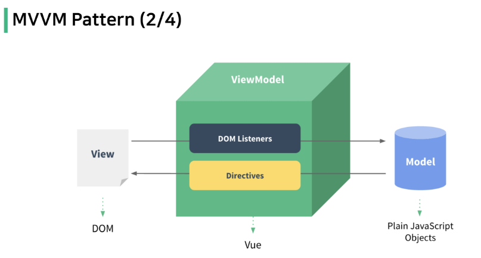
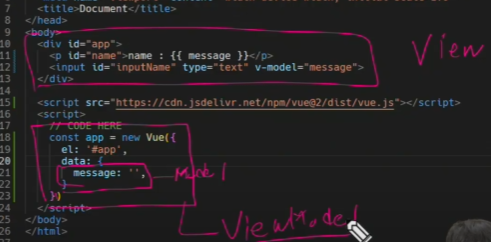

# 01_Vue 1031  

---  

### INDEX  
> - Vue intro
> - Why Vue
> - Vue instance  
> - Basic of syntax  
> - Vue advanced  

---  

앞으로 Frond-end는 Js활용, Back-end는 Django로 진행  

Vue.js == JavaScript Front-end Framework  

#### Front-end Framework  

Web app(SPA) - Single Page Application  
: 웹 브라우저에서 실행되는 어플리케이션 소프트웨어  
개발자 도구 > 디바이스 모드  
웹 페이지가 마치 App처럼 레이아웃이 변경되서 나온다. 
웹 페이지가 디바이스에 맞는 적절한 UX/UI로 표현되는 형태  

이런 역할을 Front-End Framework이 이런 기능을 한다.  

#### SPA - Single Page Application   
: 최초 1장만 HTML 전달받고, 모든 요청에 대응하는 방식  
&rightarrow; 문서는 한장만 받고, 수정해나가는 방식  

CSR (Client Side Rendering) 방식으로 요청을 처리하기 때문에 한 페이지로 모든 요청에 대응 가능   

- [참고] SSR (Server Side Rendering)  
: 기존의 요청 처리 방식  
  Server가 모든것을 다 만들고 최종본을 준다.  
  Server가 렌더링  
  브라우저는 새로고침 진행  
  
- CSR (Client Side Rendering)  
: 화면을 만드는 주체가 Server가 아니라 Client  
  최초의 한장 HTML 받아오는 것은 동일, 이때 빈 HTML을 받아온다.  
 각 요청에 대한 대응을 JS로 필요한 부분만 렌더링  
  새로운 페이지를 서버에 `AJAX`로 요청 &rightarrow; JSON 방식으로 전달 &rightarrow; JSON 데이터를 JS로 처리, DOM 트리에 반영  
  
- 왜 CSR 방식을 사용할까?  
    - 장점  
    : 모든 HTML 페이지를 서버로부터 받아서 표시하지 않아도 된다.  
      &rightarrow; 트래픽 감소 &rightarrow; 응답 속도가 빨라진다.  
      
      매번 새 문서를 받아 새로고침 X, 필요한 부분만 고쳐 나간다.  
      요청이 끊김없이 자연스럽게 진행  
      
      Back-End와 Front-End의 작업 영역을 명확하게 분리할 수 있다.  
    
    - 단점  
    : 첫 구동시 필요한 데이터가 많을수록 최초 작동 시작까지 오랜 시간이 소요된다.  
      &rightarrow; 모바일에 설치된 Web-App을 실행하게 되면 잠깐의 로딩 시간 필요하다.  
        
      검색 엔진 최적화(Search Engine Optimization)가 어렵다.  
      &rightarrow; 텅 빈 HTML에 JSON 데이터로 내용을 채우는 것은 Clinet가 진행  
        
    - SEO  
    : 검색 엔진에 노출되도록 효율적으로 개선하는 과정을 일컫는 작업  
      
---  
### Why Vue  
:쉽다.  
Vue 구조는 매우 직관적이다.  

```vue
<template>
  <!-- HTML -->
  <div>
    <p>Hello :)</p>
  </div>
</template>

<script>
  // JavaScript
</script>

<style>
  /* CSS */
  p {
    color: black;
  }
</style>
```  

Vue 없이 코드 작성  
```html
<!DOCTYPE html>
<html lang="en">
<head>
  <meta charset="UTF-8">
  <meta http-equiv="X-UA-Compatible" content="IE=edge">
  <meta name="viewport" content="width=device-width, initial-scale=1.0">
  <title>Document</title>
</head>
<body>
  <div id="app">
    <p id="name">name : </p>
    <input id="inputName" type="text">
  </div>

  <script>
    const name = document.querySelector('#name')
    const input = document.querySelector('#inputName')
    input.addEventListener('input', function (e) {
      name.innerText = 'name : ' + e.target.value
    })
  </script>
    
</body>
</html>

```  

Vue 작업 시작하기 위해 CDN을 가져와야 한다.  

우리는 Vue2를 쓰겠다.  

```html
<script src="https://cdn.jsdelivr.net/npm/vue@2/dist/vue.js"></script>
```  

input 태그에 v-model 인자추가로 동기화한다.  

```html
<!DOCTYPE html>
<html lang="en">
<head>
  <meta charset="UTF-8">
  <meta http-equiv="X-UA-Compatible" content="IE=edge">
  <meta name="viewport" content="width=device-width, initial-scale=1.0">
  <title>Document</title>
</head>
<body>
  <div id="app">
    <p id="name">name : {{message}} </p>
    <input id="inputName" type="text" v-model="message">
  </div>
  
  <script src="https://cdn.jsdelivr.net/npm/vue@2/dist/vue.js">
  </script>
  <script>
    // CODE HERE
    const app = new Vue({
      el: '#app',
      data: {
        message: '',
      },
    })
  </script>
</body>
</html>
```  

---  
### Vue instance  

#### MVVM Pattern  
: 소프트웨어 아키텍처 패턴의 일종  
View - ViewModel - Model  
View - 실제로 보이는 부분(DOM)  
Model - 실제 데이터(JSON)  
View Model(Vue)  
: View를 위한 Model  

View와 Model은 데이터가 각각 구역이 정해져있어서 독립적이다. 
  
  
영역을 나누면 위와 같다.  

### [참고] 생성자 함수  
: 동일한 구조의 객체를 여러 개 만들고 싶을때 사용하는 함수  
`new` 연산자로 사용하는 함수  
반드시 대문자로 시작  

```JavsScripts
const member = {
  name: 'aiden',
  age: 22,
  sId: 2022311491,
}

const member2 = {
  name: 'haley',
  age: 20,
  sId: 2022311492,
}

function Member(name, age, sId) {
  this.name = name
  this.age = age
  this.sId = sId
}

const member3 = new Member('isaac', 21, 2022654321)
```

- el(element)  
: Vue instance와 DOM을 mount(연결)하는 옵션  
  - View와 Model을 연결하는 역할  
    HTML id 혹은 class와 마운트 가능  
    대부분 id로 연결  
    
- data  
: Vue instance의 데이터 객체 혹은 인스턴스 속성  
  데이터 객체는 반드시 기본 객체 {}(Object) 여야 한다.  
  객체 내부의 아이템들은 value로 모든 타입의 객체를 가질 수 있다.  
  정의된 속성은 interpolation{{}}을 통해 view에 렌더링 가능하다.    
  
- methods  
: Vue instance의 method들을 정의 하는 곳  
  객체내 print method 정의
  여기서 this는 methods의 객체(Vue)이다.
  원래는 data 정의후, methods 정의할 때,  
  `instance.$data.message`처럼 작성해야 하지만, 그냥 this.message로 적어도 된다.  
  
```html
    const app = new Vue({
      el: '#app',
      // 3. data
      data: {
        message: 'Hello, Vue!'
      },

    //   // 4. methods
      methods: {
        print: function () {
          console.log(this.message)
        },
    })
```  
`app.print()`: this.message 출력하는 methods가 된다.

```html
bye: function () { // message를 아래와 같이 바꾸는 함수.
          this.message = 'Bye, Vue!'
        },
```
message를 변경하는 함수 app.bye()  

```html
arrowBye: () => {
          this.message = 'Arrow Function?'
          console.log(this)
        }
```  
arrow function의 this는 window를 가르키고, 이는 메서드 정의 할때 사용할 수 없다.  
선언시 에러는 안나지만, window의 message를 만든것과 똑같다.

---  
### Basic of Syntax  

- Template Syntax  
  - 렌더링 된 DOM  
    : 브라우저에 의해 보기 좋게 그려질 HTML 코드  
    
  - HTML 기반 template syntax  
    
  - 선언적으로 바인딩  
   
  
```html
<div id="app">
    <p>메시지: {{ msg }}</p>   
    <p>HTML 메시지 : {{ rawHTML }}</p>
    <p>HTML 메시지 : <span v-html="rawHTML"></span></p>
    <p>{{ msg.split('').reverse().join('') }}</p>
  </div>
    const app = new Vue({
      el: '#app',
      data: {
        msg: 'Text interpolation',
        rawHTML: '<span style="color:red"> 빨간 글씨</span>'
      }
    })
```   

#### Directives  

v-접두사가 있는 특수 속성에는 값을 할당 할 수 있다.  
directive 역할은 표현식의 값이 변경될 때 반응적으로 DOM에 적용하는 것  

`v-on:submit.prevent="onSubmit"`

- `v-text`  
: 가장 기본적인 바인딩 방법  
  
- `v-html`  
 RAW HTML을 표현할 수 있는 방법  
  사용자가 입력하거나 제공하는 컨텐츠에는 절대 사용 금지  
  
- `v-show`  
boolean 값이 변경 될 때 마다 반응  
  대상 element의 dispaly 속성을 기본 속성과 none으로 toggle  
  요소 자체는 항상 DOM에 렌더링 된다.(자리는 차지한다.)  
  초기 렌더링에 필요한 비용은 v-if 보다 높을 수 있다.
  toggle 비용은 적다.

- `v-if`  
: isActiva의 값이 변경 될 때 반응  
  false인 경우, DOM에서 사라진다.  
  초기 렌더링 비용은 v-show보다 낮을수 있다.(false면 존재X)  
  toggle은 비싸다. True면 다시 만들어야하니까.  
  
- `v-for`  
: `for .. in ..`형식으로 작성  
  
```html
<!DOCTYPE html>
<html lang="en">
<head>
  <meta charset="UTF-8">
  <meta http-equiv="X-UA-Compatible" content="IE=edge">
  <meta name="viewport" content="width=device-width, initial-scale=1.0">
  <title>Document</title>
</head>
<body>
  <!-- 3. v-for -->
  <div id="app">
    <h2>String</h2>
    <div v-for="char in myStr">
      {{char}}
    </div>
      
    <div v-for="(char, index) in myStr" :key="index">
      <p>{{ index }}번째 문자열 {{ char }}</p>
    </div>

    <h2>Array</h2>
    <div v-for="(item, index) in myArr" :key="index">
      <p>{{ index }}번째 아이템 {{ item }}</p>
    </div>

    <div v-for="(item, index) in myArr2" :key="`arry-${index}`">
      <p>{{ index }}번째 아이템</p>
		  <p>{{ item.name }}</p>
    </div>

    <h2>Object</h2>
    <div v-for="value in myObj">
      <p>{{ value }}</p>
    </div>

    <div v-for="(value, key) in myObj"  :key="key">
      <!-- 그냥 객체에는 2번째 인자가 key -->
      <p>{{ key }} : {{ value }}</p>
    </div>
  </div>

  <script src="https://cdn.jsdelivr.net/npm/vue@2/dist/vue.js"></script>
  <script>
    const app = new Vue({
      el: '#app',
      data: {
        // 1. String
        myStr: 'Hello, World!',

        // 2-1. Array
        myArr: ['python', 'django', 'vue.js'],

        // 2-2. Array with Object
        myArr2: [
          { id: 1, name: 'python', completed: true},
          { id: 2, name: 'django', completed: true},
          { id: 3, name: 'vue.js', completed: false},
			  ],
        
        // 3. Object
        myObj: {
          name: 'harry',
          age: 27
        },
      }
    })
  </script>
</body>
</html>

```  
마지막 Object 객체에서 key가 뒤로 들어온다.  

- [참고] 특수 속성 key  
: `v-for` 사용 시 반드시 key 속성을 각 요소에 작성해야 한다.  
  주로 v-for directive 작성 시 사용된다.  
  같은 template에 key가 중복되어서는 안된다.  
  
- `v-on` `:`을 통해 전달받은 인자 확인  
`<button v-on:click="number++">` : 버튼 클릭시 number를 더해주겠다.  
  
`v-on:` <=> `@`  

- `v-bind`  

```html
<!DOCTYPE html>
<html lang="en">
<head>
  <meta charset="UTF-8">
  <meta http-equiv="X-UA-Compatible" content="IE=edge">
  <meta name="viewport" content="width=device-width, initial-scale=1.0">
  <title>Document</title>
  <style>
    .red-text {
      color: red;
    }
    .border-black {
			border: solid 1px black;
		}

    .dark-mode {
      color: white;
      background-color: black
    }

    .white-mode {
      color: black;
      background-color: white;
    }
  </style>
</head>
<body>
  <div id="app">
    <button v-on:click="number++">increase Number</button>
    <p>{{ number }}</p>

    <button v-on:click="toggleActive">toggle isActive</button>
    <p>{{ isActive }}</p>

    <button @click="checkActive(isActive)">check isActive</button>
  </div>

  <div id="app2">
    <a v-bind:href="url">Go To GOOGLE</a>

    <p v-bind:class="redTextClass">빨간 글씨</p>
    <p v-bind:class="{ 'red-text': true }">빨간 글씨</p>
    <p v-bind:class="[redTextClass, borderBlack]">빨간 글씨, 검은 테두리</p>

    <p :class="theme">상황에 따른 활성화</p>
    <button @click="darkModeToggle">dark Mode {{ isActive }}</button>
  </div>

  <script src="https://cdn.jsdelivr.net/npm/vue@2/dist/vue.js"></script>
  <script>
    const app = new Vue({
      el: '#app',
      data: {
        number: 0,
        isActive: false,
      },
      methods: {
        toggleActive: function () {
          this.isActive = !this.isActive
        },

      checkActive: function (check) {
        console.log(check)
        }
      }
    })

    const app2 = new Vue({
      el: '#app2',
      data: {
        url: 'https://www.google.com/',
        redTextClass: 'red-text',
        borderBlack: 'border-black',
        isActive: true,
        theme: 'dark-mode'
      },
      methods: {
        darkModeToggle() {
          this.isActive = !this.isActive
          if (this.isActive) {
            this.theme = 'dark-mode'
          } else {
            this.theme = 'white-mode'
          }
        }
      }
    })
  </script>
</body>
</html>

```
: HTML 기본 속성에 Vue data를 연결  
  class의 경우 다양한 형태로 연결 가능하다.  
    - 조건부 바인딩  
    :{'class Name':'조건 표현식'}  
      삼항 연산자도 가능  
      
    - 다중 바인딩  
    : ['JS 표현식','JS 표현식',...]  
      
&Rightarrow; `v-on:` : `@` 이고, `v-bind:` : `:`  

- `v-model`  
: Vue instance와 DOM의 양방향 바인딩  
  
```html
<!DOCTYPE html>
<html lang="en">
<head>
  <meta charset="UTF-8">
  <meta http-equiv="X-UA-Compatible" content="IE=edge">
  <meta name="viewport" content="width=device-width, initial-scale=1.0">
  <title>Document</title>
</head>
<body>
  <div id="app">
    <h2>1. Input -> Data</h2>
    <h3>{{ myMessage }}</h3>
    <input @input="onInputChange" type="text">
    <hr>

    <!-- <h2>2. Input <-> Data</h2>
    <h3>{{ myMessage2 }}</h3>
    <input v-model="myMessage2" type="text">
    <hr> -->
  </div>

  <script src="https://cdn.jsdelivr.net/npm/vue@2/dist/vue.js"></script>
  <script>
    const app = new Vue({
      el: '#app',
      data: {
        myMessage: '',
        // myMessage2: '',
      },
      methods: {
        onInputChange: function (event) {
          this.myMessage = event.target.value
        },
      }
    })
  </script>
</body>
</html>

```  
myMessage를 보면, 입력한 event를 값에 넣는것과, v-model 넣어주는것과 같다.  

---  
### Vue advanced  

- computed(계산된 값)  
: 함수의 종속 대상의 변화에 따라 계산 여부가 결정된다.  
  종속 대상이 변하지 않으면 항상 저장(캐싱)된 값을 반환  
  
- method(호출)  
: 호출 될 때마다 함수를 실행  
  같은 결과여도 매번 새롭게 계산  
  
```html
<!DOCTYPE html>
<html lang="en">
<head>
  <meta charset="UTF-8">
  <meta http-equiv="X-UA-Compatible" content="IE=edge">
  <meta name="viewport" content="width=device-width, initial-scale=1.0">
  <title>Document</title>
</head>
<body>
  <div id="app">
    <h1>data_01 : {{ number1 }}</h1>
    <h1>data_02 : {{ number2 }}</h1>
    <hr>
    <h1>add_method : {{ add_method() }}</h1>
    <h1>add_method : {{ add_method() }}</h1>
    <h1>add_method : {{ add_method() }}</h1>
    <hr>
    <h1>add_computed : {{ add_computed }}</h1>
    <h1>add_computed : {{ add_computed }}</h1>
    <h1>add_computed : {{ add_computed }}</h1>
    <hr>
    <button v-on:click="dataChange">Change Data</button>
  </div>

  <script src="https://cdn.jsdelivr.net/npm/vue@2/dist/vue.js"></script>
  <script>
    const app = new Vue({
      el: '#app',
      data: {
        number1: 100,
        number2: 100
      },
      computed: {
        add_computed: function () {
          console.log('computed 실행됨!')
          return this.number1 + this.number2
        }
      },
      methods: {
        add_method: function () {
          console.log('method 실행됨!')
          return this.number1 + this.number2
        },
        dataChange: function () {
          this.number1 = 200
          this.number2 = 300
        }
      }
    })
  </script>
</body>
</html>

```  

- watch  
: 특정 데이터의 변화를 감지  
  
```html
  <script>
    const app = new Vue({
      el: '#app',
      data: {
        number: 0,
      },
      methods: {
      },
      watch: {
        number: function (val, oldVal) {
          console.log(val, oldVal)
        },
      }
    })
  </script>
```  
변동 전, 변동 후가 인자로 들어온다.
```html
<!DOCTYPE html>
<html lang="en">
<head>
  <meta charset="UTF-8">
  <meta http-equiv="X-UA-Compatible" content="IE=edge">
  <meta name="viewport" content="width=device-width, initial-scale=1.0">
  <title>Document</title>
</head>
<body>
  <div id="app">
    <h3>Increase number</h3>
    <p>{{ number }}</p>
    <button @click="number++">+</button>
    <hr>

    <h3>Change name</h3>
    <p>{{ name }}</p>
    <input type="text" v-model="name">
    <hr>

    <h3>push myObj</h3>
    <p>{{ myObj }}</p>
    <button @click="itemChange">change Item</button>
  </div>

  <script src="https://cdn.jsdelivr.net/npm/vue@2/dist/vue.js"></script>
  <script>
    const app = new Vue({
      el: '#app',
      data: {
        number: 0,
        name: '',
        myObj: {completed: true}
      },
      methods: {
        nameChange: function () {
          console.log('name is changed')
        },

        itemChange: function () {
          this.myObj.completed = !this.myObj.completed
        }
      },
      watch: {
        number: function (val, oldVal) {
          console.log(val, oldVal)
        },

        name: {
          handler: 'nameChange'
        },

        myObj: {
          handler: function (val) {
            console.log(val)
          },
          deep: true
        },
      }
    })
  </script>
</body>
</html>

```  

- filters  
: 텍스트 형식화를 적용할 수 있는 필터  
  
```html
<!DOCTYPE html>
<html lang="en">
<head>
  <meta charset="UTF-8">
  <meta http-equiv="X-UA-Compatible" content="IE=edge">
  <meta name="viewport" content="width=device-width, initial-scale=1.0">
  <title>Document</title>
</head>
<body>
  <div id="app">
    <p>{{ numbers }}</p>
  </div>

  <script src="https://cdn.jsdelivr.net/npm/vue@2/dist/vue.js"></script>
  <script>
    const app = new Vue({
      el: '#app',
      data: {
        numbers: [1, 2, 3, 4, 5, 6, 7, 8, 9, 10, 11, 12, 13, 14, 15],
      },
      filters: {
        getOddNums: function (nums) {
          const oddNums = nums.filter((num) => {
            return ㄴnum % 2
          })
          return oddNums
        },
        
        getUnderTenNums: function (nums) {
          const underTen = nums.filter((num) => {
            return num < 10
          })
          return underTen
        }
      }
    })
  </script>
</body>
</html>
```  
filters의 num인자는 위의 태그안에 있는 numbers다.  
`|`로 함수사용 가능하고, 체이닝(이어서 사용가능하다)가능하다.  


  

  

  


