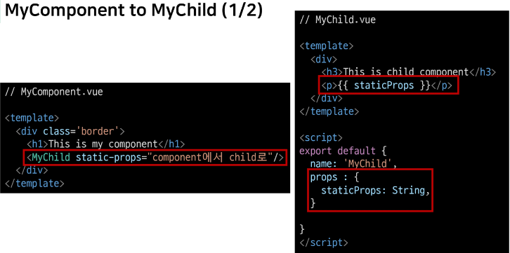
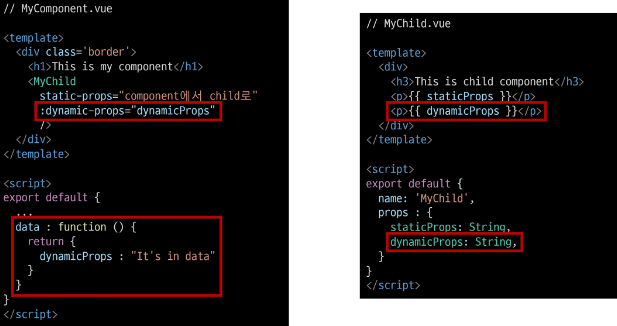
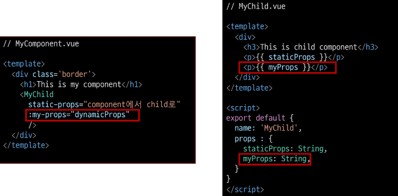
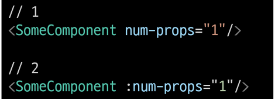
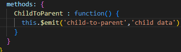
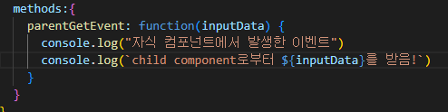
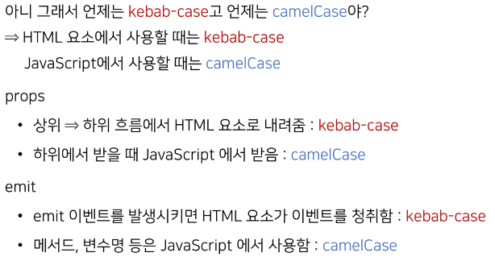

# 03 Vue(11 02)  

### INDEX  
> - Vue CLI  
> - SFC  
> - Pass Props & Emit Events  

---  
### Vue CLI  

- Node.js  
: JS는 브라우저를 조작하는 유일한 언어  
  
- NPM(Node Package Manage)  
: 자바스크립트 패키지 관리자  
  - python : pip &rightarrow; Node.js : npm  
    
- Vue CLI  
: Vue 개발을 위한 표준 도구  
  프로젝트의 구성을 도와주는 역할  
  확장 플러그인, GUI, Bable등 다양한 tool 제공  
  
> - 설치  
> `npm install -g @vue/cli`  
> 
> - 프로젝트 생성 (vscode terminal)  
> `vue create vue-cli(project_name)`  
> 
> - 버전 선택 Vue2  
> 
> - 프로젝트 디렉토리로 이동  
> `cd vue-cli`  
> 
> - 프로젝트 실행  
> `npm run serve`  

---  
#### Vue CLI 프로젝트 구조  
python의 venv와 비슷한 역할을 한다.  

- `Babel`  
: JS compiler  
  

- `Webpack`  
: static module bundler  
  모듈 간의 의존성 문제를 해결하기 위한 도구 
  
- `Module`  
: 개발하는 애플리케이션의 크기가 커지고 복잡해지면 파일 하나에 모든 기능을 담기 어려워 진다.  
  &rightarrow; 파일 분리, 관리하는데, 이 각각의 파일을 모듈  
  모듈의 수가 많아지고 의존성(연결성)이 깊어지면서 특정한 곳에서 발생한 문제가 어떤 모듈 간의 문제인지 파악하기 어렵다.  
  
- `Bundler`  
: 모듈 의존성 문제를 해결해주는 작업 &rightarrow; Bundling  
  이러한 일을 해주는 도구 &rightarrow; Bundler  
  이 중 하나가 Webpack  
  
- public/index.html  
: Vue 앱의 뼈대가 되는 html 파일  
  
- src  
    - src/assets  
    : 정적 파일을 저장하는 디렉토리  
      
    - src/components  
    : 하위 컴포넌트들이 위치  
      
    - src/App.vue  
    : 최상위 컴포넌트  
      public/index.html과 연결된다.  
      
    - src/main.js  
    : webpack이 빌드를 시작할 때 가장 먼저 불러오는 entry point  
      public/index.html과 src/App.vue를 연결시키는 작업이 이루어지는 곳  
      Vue 전역에서 활용할 모듈을 등록할 수 있는 파일  
      
---  
### SFC  

#### Component  
: UI를 독립적이고 재사용 가능한 조각들로 나눈 것  
즉, 기능별로 분화한 코드 조각  
소프트웨어 구성 요소  
    - 하나의 app을 구성할 때 중첩된 컴포넌트들의 tree로 구성하는 것이 보편적이다.  

- Component based architecture 특징  
    - 관리가 용이(유지/보수 비용 감소)  
    - 재사용성  
    - 확장 가능  
    - 캡슐화  
    - 독립적  
    

- Component in Vue  
: Vue에서 말하는 component란 무엇일까?  
    &Rightarrow; 이름이 있는 재사용 가능한 Vue instance  
  - Vue instance란?  
    : new Vue()로 만든 인스턴스  
    
- SFC(Single File Component)  
: 하나의 `.vue` 파일이 하나의 `Vue instance`이고, 하나의 `컴포넌트`이다.  
  Vue instance에서는 HTML, CSS, JavaScript 코드를 한번에 관리한다.  
  
---  
#### Vue component  
- 템플릿(HTML)  
    HTML의 body 부분  
  
- 스크립트(JavaScript)  
    JavaScript 코드가 작성되는 곳  
  컴포넌트 정보, 데이터, 메서드 등 vue 인스턴스를 구성하는 대부분  
  
- 스타일(CSS)  
    CSS가 작성되며 컴포넌트의 스타일을 담당  
  
- Vue Component 구조 정리  
: tree 구조를 이루어 하나의 페이지를 만든다.  
  최상단 component &rightarrow; `App.vue`  
  이를 index.html과 연결  
  결국 index.html 파일 하나만을 rendering &Rightarrow; SPA  
  
---  
기본 생성하면, HelloWorld.vue가 생성되어 있다.  

#### 새로운 vue 파일 생성시 해야하는 것!  
> 1. src/components/ 안에 생성  
> 2. script에 이름 등록  
> 3. template에 요소 추가  

```vue
<template>
  <div>
    <h1>이거는 내가 만든 새로운 컴포넌트다!</h1>
  </div>
  
</template>

<script>
export default {
  name: 'MyComponent',
}
</script>

<style>

</style>
```

### component 등록 3 단계  
> 1. 불러오기  
> 2. 등록하기  
> 3. 보여주기  

```vue  
// App.vue
<template>
  <div id="app">
    
    <!-- 3. 보여주기 -->
    <HelloWorld msg="Welcome to Your Vue.js App"/>
    
  </div>
</template>

<script>

import HelloWorld from './components/HelloWorld.vue'
// 1. 불러오기
// import MyComponent from './components/MyComponent.vue'
import MyComponent from '@/components/MyComponent'

export default {
  name: 'App',
  components: {
    HelloWorld,
    // 2. 등록하기
    MyComponent,
  }
}
</script>

```

- 불러오기  
`import {instance name} from {위치}`  
  
`import MyComponent from './components/MyComponent.vue'`  
`import MyComponent from '@/components/MyComponent'`

`@`는 src의 절대경로.  

- 등록하기  
```html
<script>

import HelloWorld from './components/HelloWorld.vue'
// 1. 불러오기
// import MyComponent from './components/MyComponent.vue'
import MyComponent from '@/components/MyComponent'

export default {
  name: 'App',
  components: {
    HelloWorld,
    // 2. 등록하기
    MyComponent,
  }
}
</script>
```  
&rightarrow; export default의 components안에 작성

- 보여주기  
```vue
<template>
  <div id="app">
    
    <!-- 3. 보여주기 -->
    <Mycomponent/>
    <HelloWorld msg="Welcome to Your Vue.js App"/>
    
  </div>
</template> 
```  

- 자식 컴포넌트 작성  
```vue
// MyComponentItem.vue

<template>
  <div>
    <h3>MyComponent의 하위 컴포넌트</h3>
  </div>

</template>

<script>
export default {
  name: 'MyComponentItem',
}
</script>
```  

```vue
// MyComponent.vue  

<template>
  <div class='border'>
    <h1>이거는 내가 만든 새로운 컴포넌트다!</h1>
    <MyComponentItem/>
  </div>
  
</template>

<script>
// 1. 불러오기  
import MyComponentItem from '@/components/MyComponentItem'

export default {
  name: 'MyComponent',
  components : {
    // 2. 등록하기  
    MyComponentItem,
  },
}
</script>

<style>
  .border {
    border: solid 1px black;
  }
</style>
```  

---  
### Pass Props & Emit Events  

#### Data in components

data를 정적이 아닌 동적으로 사용하려고 한다.  
component는 부모-자식 관계를 가지고 있고, 부모-자식 관계만 데이터를 주고받게 하자.  
- 데이터의 흐름을 파악하기 용이  
- 유지 보수하기 쉬워진다.  

- 부모 &Rightarrow; 자식으로의 데이터의 흐름  
    - `pass props`의 방식

- 자식 &Rightarrow; 부모로의 데이터의 흐름  
    - `emit event`의 방식  
    
---  
#### Pass Props  
: 요소의 속성을 사용하여 데이터 전달  
props는 부모(상위) 컴포넌트의 정보를 전달하기 위한 사용자 지정 특성  
자식(하위) 컴포넌트는 props 옵션을 사용하여 수신하는 props를 명시적으로 선언  

부모의 template에서 자식vue 태그로 작성 컴포넌트를 출력하는데, 이 태그내에 props를 넣어준다.  
정적인 데이터를 전달하는 경우 `static props`라고 한다.  
- `prop-data-name="value`(kebab-case)의 형태로 데이터 전달  

받는 자식 vue에서는 prop을 명시해줘야한다.  

```vue  
// HelloWorld.vue  

<script>
export default {
  name: 'HelloWorld',
  props: {
    msg: String
  }
}
</script>
```  
부모 vue에서 보내면, 자식 props에 넣어주어야 한다.  
  

- Pass Props convention  
부모에서 넘겨주는 props는 `kebab-case`  
  자식에서 받는 props는 `camelCase`  
  
- Dynamic props  
: 변수를 props로 전달할 수 있다.  
  `v-bind directive`를 사용해 데이터를 동적으로 바인딩  
  
  
부모에서 자식으로 변수를 내릴때, 함수형태로 넣어주어야 한다.  
각 vue 인스턴스는 같은 data 객체를 공유하므로 새로운 data 객체를 반환하여 사용해야 한다.  

- `:dynamic-props="dynamicProps"`  
앞의 key 라는 이름으로 뒤의 " "안에 오는 데이터를 전달하겠다.  
  
  
kebab-case로 보냈고, 자식 vue에서는 camelCase로 작성한다.  

  
첫번째 방식은 static props로 string으로써의 "1"전달  
두번째 방식은 dynamic props로 숫자로써의 1을 전달  

- 단방향 데이터 흐름  
: 모든 props는 부모에서 자식으로 단방향 바인딩 형성  
  부모 속성이 업데이트되면 자식으로 흐르지만 반대는 안된다.  
  
---  
#### Emit Event  
: 부모 컴포넌트에서 자식 컴포넌트로 데이터를 전달할 때는 event 발생  
- 이벤트를 발생시키는 게 어떻게 데이터를 전달하는 것일까?  
  > 1. 데이터를 이벤트 리스너의 콜백함수의 인자로 전달  
  > 2. 상위 컴포넌트는 해당 이벤트를 통해 데이터를 받ㄴ는다.  
  
- $emit  
: $emit 메서드를 통해 부모 컴포넌트에 이벤트를 발생  
  - `$emit('event-name')`형식으로 사용, 부모 컴포넌트에 `event-name`라는 이벤트가 발생했다는 것을 알린다.  
  - 마치 사용자가 마우스 클릭하면 click 이벤트가 발생하는 것처럼 $emit('event-name')가 실행되면 event-name 이벤트가 발생하는 것  
    
- 자식vue부터  
버튼 만들고 클릭 이벤트 추가  
  $emit을 통해 부모 컴포넌트에게 child-to-parent 이벤트를 트리거  
```vue
// MyCOmponentItem.vue
<template>
  <div>
    <h3>MyComponent의 하위 컴포넌트</h3>
    <p>{{staticProps}} </p>
    <p>{{dynamicProps}} </p>
    <button @click="ChildToParent">클릭!!</button>
  </div>

</template>

<script>
export default {
  name: 'MyComponentItem',
  props: {
    staticProps : String,
    dynamicProps : String,
  },
  methods: {
    ChildToParent : function() {
      this.$emit('child-to-parent')
    }
  }
}
</script>

```

emit된 이벤트를 상위 컴포넌트에서 청취 후 핸들러 함수 실행  
```vue
// MyComponent.vue  
<template>
  <div class='border'>
    <h1>이거는 내가 만든 새로운 컴포넌트다!</h1>
    <MyComponentItem
      static-props="component에서 child로"
      :dynamic-props="dynamicProps"
      @child-to-parent = "parentGetEvent"
    />
  </div>
  
</template>

<script>
// 1. 불러오기  
import MyComponentItem from '@/components/MyComponentItem'

export default {
  name: 'MyComponent',
  data: function () {
    return {
      dynamicProps : '이건 동적인 데이터!',
    }
  },
  components : {
    // 2. 등록하기  
    MyComponentItem,
  },
  methods:{
    parentGetEvent: function() {
      console.log("자식 컴포넌트에서 발생한 이벤트")
    }
  }
}
</script>
```  

- Emit Event 흐름 정리  
1. 자식 컴포넌트에 있는 버튼 클릭 이벤트를 청취하여 연결된 핸들러 함수(ChildToParent) 호출  
2. 호출된 함수에서 `$emit`을 통해 상위 컴포넌트에 이벤트(child-to-parent) 발생  
3. 상위 컴포넌트는 자식 컴포넌트가 발생시킨 이벤트(child-to-parent)를 청취하여 연결된 핸들러 함수(parentGetEvent) 호출  

- emit with data  
: 이벤트를 발생(emit)시킬 때 인자로 데이터 전달 가능  
  
  
  


$emit('','보낼데이터')  &rightarrow; function(받는데이터)  

#### emit with data 흐름 정리  
1. 자식 컴포넌트에 있는 버튼 클릭 이벤트를 청취하여 연결된 핸들러 함수(ChildToParent) 호출  
2. 호출된 함수에서 $emit을 통해 부모 컴포넌트에 이벤트(child-to-parent)를 발생  
- 이벤트에 데이터(child data)를 함께 전달  
3. 부모 컴포넌트는 자식 컴포넌트의 이벤트(child-to-parent)를 청취하여 연결된 핸들러 함수(parentGetEvent) 호출, 함수의 인자로 전달된 데이터(child data)가 포함되어 있음  
4. 호출된 함수에서 `console.log('child data')` 실행  

---  
#### 정리  
- 자식 컴포넌트에서 부모 컴포넌트로 이벤트를 발생시킴  
  - 이벤트에 데이터를 담아 전달 가능  
    
- 부모 컴포넌트에서는 자식 컴포넌트의 이벤트를 청취  
  - 전달받은 데이터는 이벤트 핸들러 함수의 인자로 사용  
    
  
