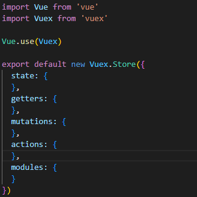
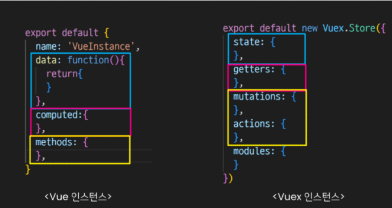
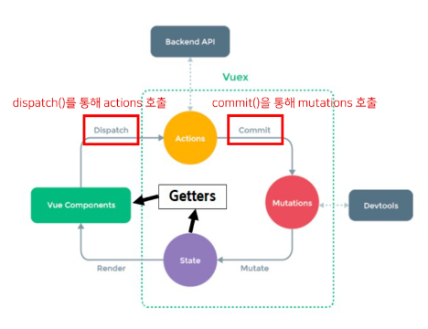
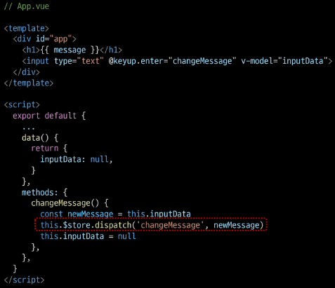
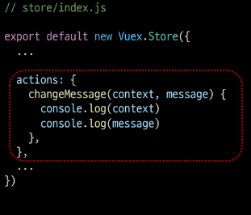
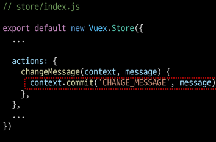
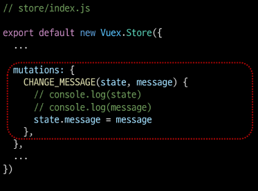
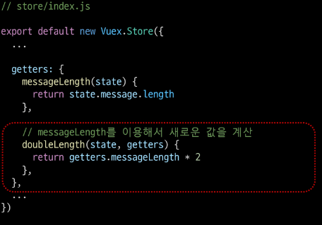
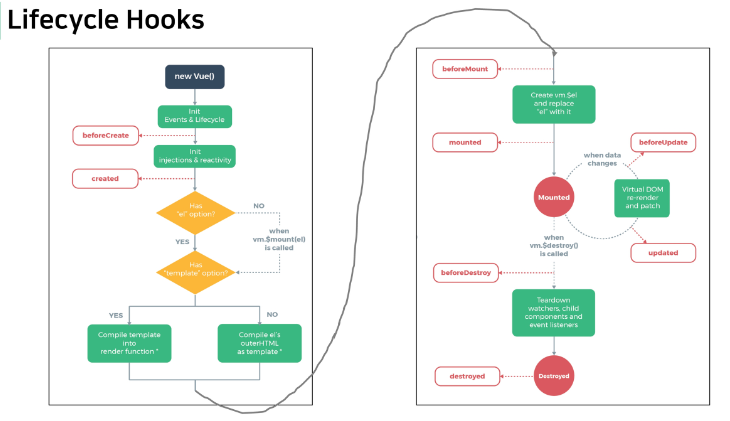
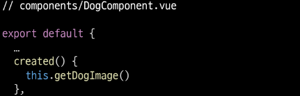

# 1107 Vue  

### INDEX  
> - Vuex
> - Lifecycle Hooks  
> - Todo with Vuex  

---  
### Vuex  

#### State Management  

- 상태관리  
    상태(State)란?  
    : 현재에 대한 정보(data)  
    
    Web Application에서의 상태는 App이 가지고 있는 Data로 표현할 수 있다.  
    
    우리는 여러개의 component를 조합해서 하나의 App을 만들고 있다.  
    각 component는 독립적이기 때문에 각각의 상태(data)를 가진다.  
  
    &rightarrow; 여러 개의 component가 같은 상태(data)를 유지할 필요가 있다.  
    &Rightarrow; 상태 관리(State Management) 필요!  
  

- Pass Props & Emit Event  
: props와 event를 이용해서, 같은 데이터를 공유하고 있다.  
  이때, component의 중첩이 깊어지면 데이터 전달이 쉽지 않다.  
  이를 해결하기 위해 중앙 저장소에 데이터를 모아서 상태 관리한다.  
  
- Centralized Store  
  - 중앙 저장소(store)에 데이터를 모아서 상태 관리  
  - 각 component는 중앙 저장소의 데이터를 사용  
  - 계층에 상관없이 중앙 저장소에 접근해서 데이터 얻거나 변경가능  
    
#### Vuex  
: "state management pattern + Library" for vue.js (상태 관리 패턴 + 라이브러리)  
중앙 저장소를 통해 상태 관리를 할 수 있도록 하는 라이브러리  
데이터가 예측 가능한 방식으로만 변경 될 수 있도록 하는 규칙을 설정, Vue의 반응성을효율적으로 사용하는 상태 관리 기능을 제공  

---  
### Vuex 시작하기  
`vue create vuex-app` : Vue 프로젝트 생성  
`cd vuex-app` : 디렉토리 이동  
`vue add vuex` : Vue CLI를 통해 vuex plugin 적용  

- 프로젝트 with vuex  
: src / store / index.js 가 생성되었다.  
  
  

- vuex의 핵심 컨셉 4가지  
> - state  
> - getters  
> - mutations  
> - actions  

  

### 1. State  
- vue instance의 data에 해당  
- 중앙에서 관리하는 모든 상태 정보  
- 개별 component는 state에서 데이터를 가져와서 사용  
  - 개별 component가 관리하던 data를 중앙 저장소(Vuex Store의 state)에서 관리하게 된다.  
- state의 데이터가 변화하면 해당 데이터를 사용(공유)하는 component도 자동으로 다시 렌더링  
- `$store.state`로 state 데이터에 접근  

### 2. Mutations  
- 실제로 state를 변경하는 유일한 방법  
- vue instance의 methods에 해당하지만 Mutations에서 호출되는 핸들러(handler) 함수는 반드시 `동기적` 이어야 한다.  
  - 비동기 로직으로 mutations를 사용해서 state를 변경하는 경우, state의 변화의 시기를 특정할 수 없기 때문  
    
- 첫 번째 인자로 state를 받으며, component 혹은 Actions에서 `commit()`메서드로 호출된다.  

### 3. Actions  
- mutations와 비슷하지만 `비동기`작업을 포함할 수 있다는 차이가 있다.  
- state를 직접 변경하지 않고 `commit()`메서드로 mutations를 호출해서 state를 변경한다.  
- context 객체를 인자로 받으며, 이 객체를 통해 store.js의 모든 요소와 메서드에 접근할 수 있다.(state를 직접 변경할 수 있지만 하지 않아야 한다.)  
- component에서 `dispatch()` 메서드에 의해 호출된다.  

#### Mutations & Actions  
: vue component의 methods 역할이 vuex에서 분화된다.  
  

- Mutations  
  : state를 변경  
  
- Actions  
  : state 변경을 제외한 나머지 로직  
  

### 4. Getters  
- vue instance의 coumputed에 해당  
- state를 활용하여 계산된 값을 얻고자 할 때 사용  
  state의 원본 데이터를 건들지 않고 계싼된 값을 얻을 수 있다.  
- computed와 마찬가지로 getters의 결과는 캐시(cache)되며, 종속된 값이 변경된 경우에만 재계산된다.  
- getters에서 계산된 값은 state에 영향을 미치지 않는다.  
- 첫번째 인자로 `state`, 두번째 인자로 `getter`를 받는다.  

Vuex에서도 pass props, emit event를 사용해서 상태를 관리할 수 있다.  

---  
### 정리  

- state  
  - 중앙에서 관리하는 `모든 상태 정보`  
    
- mutations  
  - `state를 변경`하기 위한 methods  
    
- actions  
  - `비동기 작업이 포함될 수 있는(외부 API와의 소통 등)` methods  
  - state를 변경하는 것 외의 모든 로직 진행  
    
- getters  
  - state를 활용해 `계산한 새로운 변수 값`  
    
- component에서 데이터를 조작하기 위한 데이터의 흐름  
  - component &Rightarrow; (actions) &Rightarrow;mutations &Rightarrow; state  
    
- component에서 데이터를 사용하기 위한 데이터의 흐름  
  - state &Rightarrow;(getters) &Rightarrow; component  
    
---  
### Vuex 실습  

#### Object method shorthand  
: 이제부터 객체 메서드 축약형을 사용하겠다.  

- state  
```Javascript
// before
const obj1 = {
  addValue: function (value) {
    return value  
  },
}

// after  
const obj2 = {
  addValue(value) {
    return value  
  },
}
```  

```javascript  
// store/index.js  

import Vue from 'vue'
import Vuex from 'vuex'

Vue.use(Vuex)

export default new Vuex.Store({
  state: {
    message: 'message in store'
  },
  getters: {
  },
  mutations: {
  },
  actions: {
  },
  modules: {
  }
})
```  
```vue
// App.vue  

<template>
  <div id="app">
    <h1>{{ $store.state.message}}</h1>
  </div>
</template>

<script>

export default {
  name: 'App',
  computed: {
    message() {
      return this.$store.state.message
    }
  }
}
</script>
```  
`store.state`로 바로 접근하기 보다 `computed`에 정의 후 접근하는 것을 권장    

- actions  
:state를 변경할 수 있는 mutations 호출  
  component에서 `dispatch()`에 의해 호출  
  
- `dispatch(A,B)`  
  - A : 호출하고자 하는 actions 함수  
  - B : 넘겨주는 데이터(payload)  
    
  
- actions에 정의된 changeMessage 함수에 데이터 전달하기  
- component에서 actions는 `dispatch()`에 의해 호출  

  
- actions의 첫 번째 인자는 `context`  
  - context는 store의 전반적인 속성을 모두 가지고 있으므로 context.state와 context.getters를 통해  
    mutations를 호출하는 것이 모두 가능  
    
  - `dispatch()`를 사용해 다른 actions도 호출할 수 있다.  
  - 단, actions에서 state를 직접 조작하는 것은 삼가야 한다.  
    
- actions의 두 번째 인자는 `payload`  
  - 넘겨준 데이터를 받아서 사용  
    
- mutations  
: actions에서 `commit()`을 통해 mutations 호출하기  
  mutations은 state를 변경하는 유일한 방법  
  component 또는 actions에서 `commit()`에 의해 호출  
  
  
  

- `commit(A,B)`  
  - A: 호출하고자 하는 mutations 함수  
  - B: payload  
    
- getters  
: state를 활용한 새로운 변수  
  - getters 함수의  
    - 첫 번째 인자는 state  
    - 두 번째 인자는 getters  
      
  

---  
### Lifecycle Hooks  
: 각 Vue 인스턴스는 생성과 소멸의 과정 중 단계별 초기화 과정을 거친다.  
  Vue 인스턴스가 생성된 경우, 인스턴스를 DOM에 마운트하는 경우, 데이터가 변경되어 DOM를 업데이트하는 경우 등  
각 단계가 트리거가 되어 특정 로직 실행 가능 &rightarrow; Lifecycle Hooks  

  

- created  
: Vue instance가 생성된 후 호출  
  data, computed 등의 설정 완료된 상태  
  서버에서 받은 데이터를 vue instance의 data에 할당하는 로직을 구현하기 적합  
  단, mount 되지 않아 요소에 접근할 수 없다.  
  
  만약 처음부터 실행할때, 기본 사진 출력을희망하면,  
    
  
- mounted  
: Vue instance가 요소에 mount된 후 호출된다.  
  mount된 요소를 조작할 수 있다.  
  created의 경우, mount 되기 전이기 때문에 DOM에 접근할 수 없다.  
  
- updated  
: 데이터가 변경되어 DOM에 변화를 줄 때 호출된다.  
  
#### Lifecycle Hooks 특징  
- instance마다 각각의 Lifecycle을 가지고 있다.  
- Lifecycle Hooks는 컴포넌트별로 정의할 수 있다.  
  부모 컴포넌트의 mounted hook이 실행 되었다고 해서 자식이 mount 된 것이 아니고,  
  부모 컴포넌트가 updated hook이 실행 되었다고 해서 자식이 updated 된 것이 아니다.  
  &Rightarrow; instance마다 각각의 Lifecycle을 가지고 있기 때문이다.  
  
---  
### Todo with Vuex  


