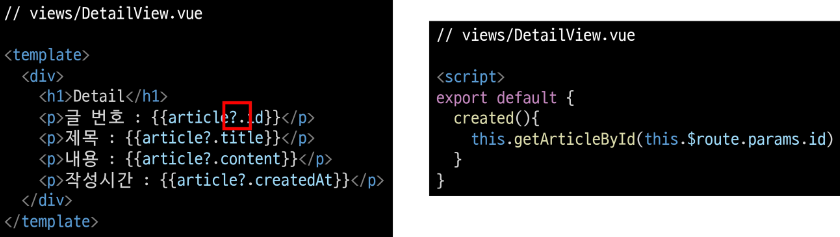

# 1109 Vue  

### INDEX  
> - UX & UI  
> - Vue Router  
> - Navidation Guard  
> - Articles app with Vue  

---  

### UX & UI  

#### UX(User Experience)  
: 유저의 경험  
유저와 가장 가까이에 있는 분야, 데이터를 기반으로 유저를 조사하고 분석해서 개발자, 디자이너가 이해할 수 있게 소통  
- 좋은 UX를 설계하기 위해서  
&Rightarrow; 사람들의 마음 생각을 이해, 정리해서 제품에 녹여내는 과정이 필요  
  유저 리서치, 데이터 설계 및 정제, 유저 시나리오, 프로토타입 설계 등이 필요하다.  
  
#### UI(User Interface)  
: 유저에게 보여지는 화면을 디자인  
UX를 고려한 디자인을 반영, 이 과정에서 기능 개선 혹은 추가가 필요한 경우 Front-end 개발자와 가장 많이 소통  

- [참고] Inter face  
: 서로의 다른 두 개의 시스템, 장치 사이에서 정보나 신호를 주고 받는 경우의 접점   
    - 즉, 사용자가 기기를 쉽게 동작 시키는데 도움을 주는 시스템  
    ex) CLI(command-line interface), GUI(Graphic User Interface)  
      
- 좋은 UI를 설계하기 위해서?  
&Rightarrow; 협업  
  
- HCI(Human Computer Interaction)  
: 인간과 컴퓨터 사이의 상호작용에 대한 학문  
  
---  
### Prototyping  

- Software prototyping  
: application의 prototype을 만드는 것  
  
---  
### Vue Router  

#### Routing  
: 네트워크에서 경로를 선택하는 프로세스  
웹 서비스에서의 라우팅  
유저가 방문한 URL에 대해 적절한 결과를 응답하는 것  

#### Routing in SSR  
: Server가 모든 라우팅을 통제  
URL로 요청이 들어오면 응답으로 완성된 HTML 제공  
Django로 보낸 요청의 응답 HTML은 완성본인 상태였다.  
&Rightarrow; Routing(URL)에 대한 결정권을 서버가 가진다.  

#### Routing in SPA / CSR  
: 서버는 하나의 HTML(index.html) 만을 제공  
이후에 모든 동작은 하나의 HTML 문서 위에서 JavaScript 코드를 활용  
  DOM을 그리는데 필요한 추가적인 데이터가 있다면 axios와 같은 AJAX 요청을 보낼 수 있는 도구를 사용하여 데이터를 가져오고 처리  
&Rightarrow; 하나의 URL만 가질 수 있다.  

---  
### Vue Router  
: Vue의 공식 라우터  
SPA 상에서 라우팅을 쉽게 개발할 수 있는 기능을 제공  
라우트(routes)에 컴포넌트를 매핑한 후, 어떤 URL에서 렌더링 할지 알려줌  
SPA의 단점 중 하나인 "URL 변경되지 않는다" 해결  

- MPA(Multiple Page Application)  
: 여러 개의 페이지로 구성된 애플리케이션  
  SSR 방식으로 렌더링  
  
--- 
### Vue Router 시작하기  
`$ vue create vue-router-app`  
`$ cd vue-router-app`  
`$ vue add router`  

#### History mode  
: 브라우저의 History API를 활용한 방식  
  - 새로고침 없이 URL 이동 기록을 남길 수 있다.  
- 우리에게 익숙한 URL 구조로 사용 가능  

- App.vue  
: router-link 요소 및 router-view가 추가된다.  
    
    
- router/index.js 생성  
- views 폴더 생성  

---  
- `router-link`  
: a 태그와 비슷한 기능 &rightarrow; URL을 이동시킨다.  
  - routes에 등록된 컴포넌트와 매핑된다.  
  - 히스토리 모드에서 router-link는 클릭 이벤트를 차단하여 a 태그와 달리 브라우저가 페이지를 다시 로드 하지 않도록 한다.  
    
- 목표 경로는 'to'속성으로 지정  
- 기능에 맞게 HTML에서 a 태그로 rendering 되지만, 필요에 따라 다른 태그로 바꿀 수 있다.  


- `router-view`  
  - 주어진 URL에 대해 일치하는 컴포넌트를 렌더링 하는 컴포넌트  
  - 실제 component가 DOM에 부착되어 보이는 자리를 의미  
  - router-link를 클릭하면 routes에 매핑된 컴포넌트를 렌더링  
    
  - Django에서 block tag와 비슷하다.  
    - App.vue는 base.html의 역할  
    - router-view는 block 태그로 감싼 부분  
    
- src/router/index.js  
  - 라우터에 관련된 정보 및 설정이 작성 되는 곳  
  - Django에서의 urls.py에 해당  
  - routes에 URL와 컴포넌트를 매핑  
      
      
    
- src/Views  
  - router-view에 들어갈 component 작성  
  - 기존에 컴포넌트를 작성하던 곳은 components 폴더 뿐이었지만 이제 두 폴더로 나뉘어진다.  
  - 각 폴더 안의 .vue 파일들이 기능적으로 다른 것은 아니다.  
    
  - views/  
    - routes에 매핑되는 컴포넌트, 즉 <router-view>의 위치에 렌더링 되는 컴포넌트를 모아두는 폴더  
    - 다른 컴포넌트와 구분하기 위해 View로 끝나도록 만드는 것을 권장  
    - ex) App 컴포넌트 내부의 AboutView & HomeView 컴포넌트  
    
  - components/  
    - routes에 매핑된 컴포넌트의 하위 컴포넌트를 모아두는 폴터  
    - ex) HomeView 컴포넌트 내부의 HelloWorld 컴포넌트  
    
---  
- 주소를 이동하는 2가지 방법  
> - 선언적 방식 네비게이션  
> - 프로그래밍 방식 네비게이션  

- 선언적 방식 네비게이션  
: router-link 의 `to`속성으로 주소 전달  
  - routes에 등록된 주소와 매핑된 컴포넌트로 이동  
    
  - Named Routes  
    : 이름을 가지는 routes  
      
    
  - 동적인 값을 사용하기 떄문에 v-bind를 사용해야 정상적으로 작성  
      
    
- 프로그래밍 방식 네비게이션  
  - Vue 인스턴스 내부에서 라우터 인스턴스에 `$router`로 접근할 수 있다.  
  - 다른 URL로 이동하려면 `this.$router.push`를 사용  
    - history stack에 이동할 URL을 넣는(push) 방식  
    - history stack에 기록이 남기 때문에 사용자가 브라우저의 뒤로 가기 버튼을 클릭하면 이전 URL로 이동할 수 있다.  
    
  - 결국 <router-link :to="...">과 $router.push(...)을 호출하는 것은 같다.  
      
    
- Dynamic Route Matching  
: 동적 인자 전달  
  - URL의 특정 값을 변수처럼 사용할 수 있다.  
    
  
- `$route.params`로 변수에 접근 가능  
  
  
data에 넣어서 사용하는 것을 권장  
  

- Dynamic Route Matching - 선언적 방식 네비게이션 
  - App.vue에서 harry에게 인사하는 페이지로 이동해보기  
  - params를 이용하여 동적 인자 전달 가능  
      
    
- Dynamic Route Matching - 프로그래밍 방식 네비게이션  
    
  
- route에 컴포넌트를 등록하는 또다른 방법  
  
  
- lazy-loading  
: 모든 파일을 한 번에 로드하려고 하면 모든 걸 다 읽는 시간이 매우 오래 걸린다.  
  미리 로드하지 않고 특정 라우트에 방문할 때, 매핑된 컴포넌트의 코드를 로드하는 방식을 활용할 수 있다.  
  - 모든 파일을 한 번에 로드하지 않아도 되기 때문에 최초에 로드하는 시간이 빨라진다.  
  - 당장 사용하지 않을 컴포넌트는 먼저 로드하지 않는것이 핵심  
    
---  
### Navigation Guard  
: Vue router를 통해 특정 URL에 접근할 때 다른 url로 redirect를 하거나 해당 URL로의 접근을 막는 방법  
ex) 사용자의 인증정보가 없으면 특정 페이지에 접근하지 못하게 한다.  

- 종류  
  - 전역 가드  
  : 애플리케이션 전역에서 동작  
    
  - 라우터 가드  
  : 특정 URL에서만 동작  
    
  - 컴포넌트 가드  
  : 라우터 컴포넌트 안에 정의  
    
---  
#### 전역 가능(Global Before Guard)  
- 다른 url 주소로 이동할 때 항상 실행  
- router/index.js에 `router.beforeEach()`를 사용하여 설정  
- 콜백 함수의 값으로 3개의 인자를 받는다.  
  - to : 이동한 URL 정보가 담긴 Route 객체  
  - from : 현재 URL 정보가 담긴 Route 객체  
  - next : 지정한 URL로 이동하기 위해 호출하는 함수  
    - 콜백 함수 내부에서 반드시 한 번만 호출되어야한다.  
    - 기본적으로 to에 해당하는 URL로 이동  
  
- URL이 변경되어 화면이 전환되기 전 `router.beforeEach()`가 호출된다.  
  - 화면이 전환되지 않고 대기 상태가 된다.  
  
- 변경된 URL로 라우팅하기 위해서는 `next()`를 호출해줘야 한다.  
  - next()가 호출되기 전까지 화면이 전환되지 않는다.  
  
```javascript
// router/index.js  

router.beforeEach((to,from, next) => {
  console.log('to',to)
  console.log('from',from)
  console.log('next',next)
  next() # 화면 전환을 위한 함수, 없으면 전환 X
})
```
---  
#### Login 여부에 따른 라우팅 처리  
- LoginView 추가  
  

- LoginView에 대한 라우터 링크 추가  
  
  
- 로그인 해야만 접근할 수 있도록 만들어보자!
  
  
- isAuthRequired 값에 따라 로그인이 필요한 페이지, 
로그인이 되어있지 않으면 Login 페이지로 이동  
  아니면, 기존 루트로 이동(next() 인자가 없으면 to로 이동)  
  
- isLoggedIn  
  - true인 경우  
  &rigntarrow; /hello/harry 에 해당하는 컴포넌트가 정상적으로 렌더링  
    
  - false인 경우  
  &rightarrow; 렌더링하지 않고 Login 페이지로 이동된다.  
    
- Home &Rightarrow; Login 으로 이동했는데 console창이 log가 2개가 찍힌 이유  
  - 첫번째 출력은 /hello/harry로 접속 시도 후(전역 가드에 막힘)  
    전역 가드에서 login으로 이동 요청할 때 출력  
  - 두번째 출력은 /login으로 이동 요청할 때 출력  
  
- 로그인이 필요한 페이지를 추가하면, 해당 페이지 접근 불가  
  
  
- 만약 view들이 여러 개라면 모두 추가해주어야 할까?  
  - 반대로 Login하지 않아도 되는 페이지들을 모아 둘수도 있다.  
    
    
---  
#### 라우터 가드  
: 전체 route가 아닌 특정 route에 대해서만 가드를 설정하고 싶을 때 사용  
- `beforeEnter()`  
  - route에 진입했을 때 실행된다.  
  - 라우터를 등록한 위치에 추가  
  - 단 매개변수, 쿼리, 해시 값이 변경될 때는 실행되지 않고 다른 경로에서 탐색할 때만 실행된다.  
  - 콜백 함수는 `to, from, next`를 인자로 받는다.  
  
- 이미 로그인 되어있는 경우 HomeView로 이동하기!  
  
  - 로그인 여부 변수 생성  
  - 로그인 되어 있는 경우, home으로 이동  
  - 되어 있지 않은 경우 login으로 이동  
  
---  
#### 컴포넌트 가드  
- 특정 컴포넌트 내에서 가드를 지정하고 싶을 때 사용  
- `beforeRouteUpdate()`  
  - 해당 컴포넌트를 렌더링하는 경로가 변경될 때 실행  
  about에서 input에 입력해서 jun에게 인사하는 페이지로 이동  
  navbar에 있는 Hello를 눌러서 harry에게 인사하는 페이지로 이동  
    &rightarrow; URL은 변하지만 페이지는 변화하지 않았다.  
    
  - 변화하지 않는 이유  
    - 컴포넌트가 재사용되었기 떄문이다.  
    - 기존 컴포넌트를 지우고 새로 만드는 것보다 효율적  
      - 단, lifecycle hook이 호출되지 않는다.  
      - 따라서 $route.params에 있는 데이터를 새로 가져오지 않는다.  
    - `beforeRouteUpdate()` 사용해서 처리  
      - userName을 이동할 params에 있는 userName으로 재할당  
        
        

---  
#### 404 Not Found  
: 사용자가 요청한 리소스가 존재하지 않을 때 응답  
  
&rightarrow; http://localhost:8080/404  
직접 요청하는 방식이 아닌, 요청한 리소스가 존재하지 않을 때 404로 이동하도록 하려면 어떻게 해야 할까?  
- 모든 경로에 대해서 404 page로 redirect 시키기  
  - 기존에 명시한 경로가 아닌 모든 경로가 404 page로 redirect 된다.  
  - 이때, routes에 최하단부에 작성  
    
    
- 형식은 유효하지만 특정 리소스를 찾을 수 없는 경우  
Django에게 articles/1/로 요청을 보냈지만, 1번 게시글이 삭제된 상태  
  path: '*'을 만나 404page가 렌더링 되는 것이 아니라 기존에 명시한 articles/:id/에 대한 components가 렌더링된다.  
  but, 데이터 존재 X &rightarrow; 정상적으로 렌더링 되지 안흔ㄴ다.  
    
  - 해결책  
    - 데이터가 없음을 명시  
    - 404 page로 이동해야한다.  
  
- Dog API 문서 참고하여 동적 인자로 강아지 품종을 전달해 품종에 대한 램덤 이미지를 출력하는 페이지를 만들어보기  
  
    
  - dog/hound에 접속하면 hound 품종에 대한 램덤 사진이 출력  
  - axios 요청이 오는 중 동작하고 있음을 표현하기 위한 로딩 메시지 정의  
    
    
  - axios 요청이 실패할 경우 자료가 없음을 표현하기  
    
    
  - 404페이지로 이동시키기  
    
    
---  
### Articles with Vue  
: 지금까지 배운 내용들을 종합하여 Django에서 만들었던 게시판 만들기  
- 구현기능  
> - Index   
> - Create  
> - Detail  
> - Delete  
> - 404  

- 프로젝트 시간  
`vue create articles`
  `cd articles`  
  `vue add vuex`  
  `vue add router`  
  
- App.vue  
  
  
---  
#### Index  
: articles 목록 조회  
  
- state에 게시글 필드 id, 제목, 내용, 생성일자  
- DB의 AUTO INCREMENT를 표현하기 위해 article_id를 추가로 정의해준다.  

- IndexView 컴포넌트 및 라우터 작성  
  
  
- state에서 불러온 articles 출력하기  
  
  
- ArticleItem 컴포넌트 작성  
  
  
- IndexView 컴포넌트에서 ArticleItem 컴포넌트 등록 및 props 데이터 전달  
  
  
- props 데이터 선언 및 게시글 출력  
  
  
---  
#### Create  

- CreateView 컴포넌트 및 라우터 작성  
  
  
- Form 생성 및 데이터 정의  
  
  
- v-on:{event}.prevent를 활용하여 submit 이벤트 동작 취소하기  
  
  
- actions에 여러 개의 데이터를 넘길 때 하나의 object로 만들어서 전달  
  
  
- v-model.trim을 활용하여 입력 값의 공백 제거  
  
  
- 데이터가 없는 경우 alert & 데이터가 있는 경우 actions로 전달  
  
  
- actions에서는 넘어온 데이터를 활용하여 article 생성 후 mutations 호출  
  - 이때 id로 article_id 활용  
    
    
- mutations에서는 전달된 article 객체를 사용해 게시글 작성  
  - 다음 게시글을 위해 article_id 값 1 증가  
  
      
- CreateView 컴포넌트에 Index 페이지로 이동하는 뒤로가기 링크 추가  
  
  
- IndexView 컴포넌트에 게시글 작성 페이지로 이동하는 링크 추가  
  
  
---  
#### Detail  
- DetailView 컴포넌트 및 라우터 작성  
- id를 동적인자로 전달  
  
  
- article 정의 및 state에서 articles 가져오기  
  
  
- articles에서 동적인자를 통해 받은 id에 해당하는 article 가져오기  
- 이때, 동적 인자를 통해 받은 id는 str이므로 형변환을 해서 비교  
  
  
- article 출력  
  
  
- created lifecycle hook을 통해 인스턴스가 생성되었을 때 article을 가져오는 함수 호출  
  
  
- 만약 서버에서 데이터를 가져왔다면?  
  - 우리는 현재 state를 통해 데이터를 동기적으로 가져오지만, 실제로는 서버로부터 가져온다.  
  - 데이터를 가져오는데 시간이 걸린다.  
  
- created를 주석처리하고 데이터가 서버로부터 오는데 시간이 걸림을 가정해보자  

- optional chaining(?.)을 통해 article 객체가 있을 때만 출력되도록 수정  
- created 주석을 다시 해제  
  
  
- [참고] Optional Chaining  
: Optional Chaining(?.) 앞의 평가 대상이 undefined나 null이면 에러가 발생 하지않고 undefined를 반환  
  
- Date in JavaScript  
  - `Date().toLocaleString()`을 사용하여 변환  
  
  - 로컬시간으로 변환해주는 computed 값 작성 및 출력  
    
    
    
- DetailView 컴포넌트에 뒤로가기 링크추가  
  
  
- 각 게시글을 클릭하면 detail 페이지로 이동하도록 ArticleItem에 이벤트 추가  
- v-on 이벤트 핸들러에도 인자 전달 가능  
  
  
---  
#### Delete  
- DetailView 컴포넌트에 삭제 버튼을 만들고, mutations를 호출  
  
  
- mutations에서 id에 해당하는 게시글을 지움  
  
  
- 삭제 후 index 페이지로 이동하도록 네비게이션 작성  
  
  
---  
#### 404 페이지 구현  
- NotFound404 컴포넌트 및 라우터 작성  
- Detail에 대한 route보다 먼저 등록해줘야 한다.  
  - 또한, /404로 등록하면 404번째 게시글과 혼동할 수 있게 된다.  
  
      
- DetailView 컴포넌트에 id에 해당하는 article이 없으면 404페이지로 이동  
  
  
- 요청한 리소스가 존재하지 않는 경우 
없는 id가 아닌 전혀 다른 요청에도 대비하여 404 page로 redirect 시키기  
  - $router.push와 마찬가지로 name을 이용하여 이동할 수 있다.  
    
    


   


  
  